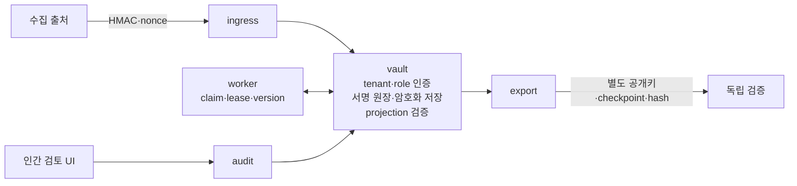
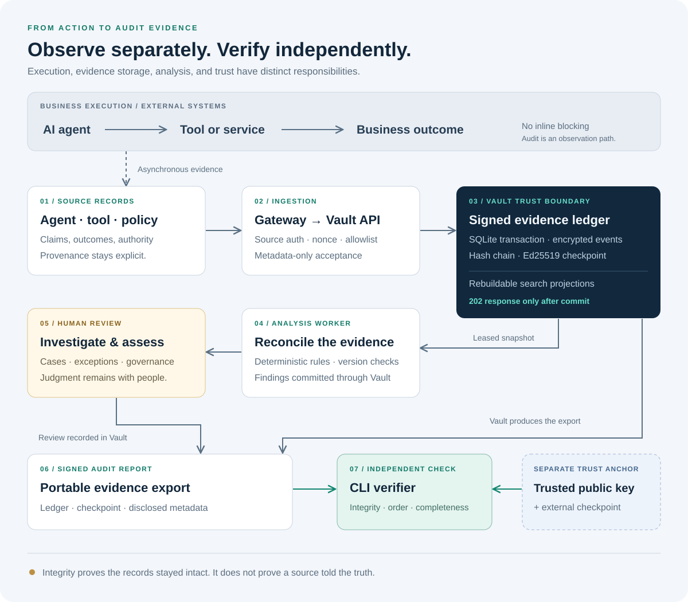

<div align="center">


# EvidScope

**AI가 무엇을 했는지, 그 근거가 충분한지 사람이 검토하도록 돕는 감사 증거·AI 거버넌스 로컬 파일럿**

**Node.js 24 · SQLite · Signed evidence · Human review**

[제품 소개·구현 이야기](docs/product-overview.md) · [아키텍처](docs/architecture.md) · [검증 현황](docs/verification-status.md) · [전체 문서](docs/README.md)

</div>

---

> **2026-10-06 기준:** 개발 소스 **v0.1.2**, 검증된 이전 로컬 설치본 **v0.1.1**. 현재 소스의 반복 검증은 미완료이며 아래에 실패 범위를 보존합니다.

## 목적과 대상

실행 로그만으로는 AI가 실제로 무엇을 했고, 당시 권한이 있었으며, 어떤 근거를 검토했는지 설명하기 어렵습니다. EvidScope는 **AI 행동 → 독립 도구 결과 → 당시 권한·정책 버전 → 원본 문서 → 사람 판단**을 연결하고 서로 대조합니다.

실행을 승인하거나 차단하는 엔진이 아닙니다. 내부감사, AI 거버넌스 담당자, 보안 운영팀이 근거를 확인하고 판단을 기록하는 도구입니다. 등록된 AI 자산, 실제로 받은 기록, 증거 커버리지를 분리해서 "등록됨"과 "확인됨"을 혼동하지 않도록 설계했습니다.

> 법률 준수 인증과 실제 금융기관 연동은 완료되지 않았습니다.

## 지원 기능

| 영역 | 내용 |
|---|---|
| 수집 | 앱 SDK·HTTP·OTLP의 지원 속성·Zeek 메타데이터를 수집하고 AI 자산을 조회합니다. 출처에서 본문을 일시 검사한 뒤 허용된 메타데이터만 중앙으로 보냅니다. |
| 근거 문서 | 일반 문서는 최대 4MiB 실파일을 암호화 보관·복구하며, 버전이 바뀌면 재검토합니다. 공급사 묶음은 별도 상한과 계약을 따릅니다. |
| 요구사항 | 요구사항 31개(한국 18개), 기술검사 23종(공급사 대체 근거 3종 포함), 시스템 schema 버전 4를 다룹니다. 미확인 사실은 `unknown`으로 보존하고 적용 후보와 사람의 최종 판단을 구분합니다. |
| 검토·보고 | 보완 과제를 관리하고 근거 없는 종결을 거부합니다. 보고서는 서명으로 고정합니다. |
| 보안·운영 | OIDC 세션 회수, tenant 격리, 암호화 백업과 새 경로 복구를 지원합니다. |

법적 지원 범위는 코드에 정의된 목록이며, 법률상 완결성을 뜻하지 않습니다.

## 구조와 스택





시스템은 ingress, audit, vault, worker 네 개 프로세스로 나뉩니다. 최종 인증과 원장은 vault가 소유하고, worker는 claim·lease·version 방식으로 분석합니다. 인간 검토 UI는 분석 경로와 분리되어 있습니다.

- **런타임**: Node.js 24.15.x ESM(`node:http`, `node:crypto`, `node:sqlite`), SQLite WAL, Vanilla JS/CSS
- **인증·무결성**: openid-client 6.8.8(OIDC), Ed25519 서명, HMAC/nonce 기반 출처 인증
- **배포**: Docker·Kubernetes 배포 도구
- **분석 방식**: 핵심 제품은 상시 LLM 없이 규칙 기반으로 분석합니다. Python/PyTorch/PEFT/QLoRA는 연구 경로로만 사용합니다.

## 구현 문제 해결

**1. 서명 원장 재검증 병목**

요청마다 전체 원장을 재검증하면서 처리 속도가 떨어졌습니다. 이를 다음과 같이 해결했습니다.

- transaction checkpoint batching을 도입했습니다.
- 검증된 checkpoint 이후의 새 suffix와 projection delta를 검증합니다.
- 변조가 감지되면 fail-closed로 처리합니다.
- 전체 export, integrity 검사, backup은 여전히 전체를 검증합니다.

2026-10-05 합성 로컬 시험에서 **1,000/1,000건**을 접수했고, sustained **600/600건·p95 206.81ms**, 최종 backlog 0을 기록했습니다. 시험 환경은 i7-12700F, 32GiB, Windows, SQLite WAL, writer 1개·worker 2개였습니다. 단일 시험 결과이며 운영 SLA가 아닙니다. [원본 벤치마크](reports/benchmark-2026-10-05T06-29-04-501Z.json).

**2. 감사자의 거버넌스 변경 권한**

reviewer·admin 권한 검사를 적용했습니다. 실제 HTTP 거부 30건에서 서명 상태가 바뀌지 않는지 회귀 시험으로 고정했습니다. 실제 인증과 독립 검증·복구가 이 프로젝트의 핵심 구현 사례입니다.

**3. 문서의 존재와 충분한 근거를 구분**

암호화한 실파일의 hash·복구 가능성과 모델·목적·정책 버전을 대조합니다. 문서 손상이나 버전 변경은 재검토로 이어지며, 근거가 부족한 과제는 종결을 거부합니다. [문제 → 구현 → 결과 상세](docs/product-overview.md#6-어떤-구현으로-어떤-문제를-해결했는가).

## 검증 결과

아래 결과는 서로 다른 소스와 시험 범위에서 나왔습니다.

- **이전 설치본 0.1.1(검증 완료)**: 전체 회귀 758/758, 39개 시험 10회 연속(390개), 제한 Linux 이미지 39/39
- **현재 개발 소스 0.1.2**: 반복 시험 8회 통과 후 9회차 117/119(2건 실패). 10회 반복은 완료되지 않았습니다.
- **과거 실행 로그** [소스 전체 검사](reports/source-full-continuation-r3-final-20261006.log): 836/836, 실패 0. 이번 게시 작업에서 새로 수행한 시험이 아닙니다.

실패 원인과 재검증 범위, 각 버전의 원본 링크는 **[검증 현황](docs/verification-status.md)**에 모았습니다.

## 모델 연구

Foundation-Sec-8B-Reasoning을 기반으로 공개 인간 주석 KLUE QA를 학습했습니다. 격리 환경의 최신 후속 학습은 **추가 optimizer 갱신 20회·adapter 계보 누적 80회**와 산출물 검증을 확인했습니다. 아래는 그보다 앞선 후보들의 관측 64문항 비교이며 최신 80회 후보의 평가 결과가 아닙니다.

- 관측 64문항 엄격 통과: 16/64 → 25/64(개선)
- 답변 가능 문항: 12/32 → 9/32(퇴행)

사람의 의미 검토와 새로운 미관측 평가 전에는 모델을 승격하지 않습니다. 합성 금융 데이터의 정식 학습도 승인되지 않았습니다.

## 발전 방향 (미완료)

- 실제 조직 IdP, 외부 SIEM, 정책·업무 결과 연동
- 원격 DMS·KMS·WORM·HA 검증
- 실제 운영 부하와 복구 목표 측정
- 미관측 평가와 사람 검토를 거친 모델 승격

향후에는 같은 감사 과제에서 근거 탐색 시간·누락 발견·연동 비용도 측정하려고 합니다. 현재 고객 성과나 상용 제품 대비 우위로 제시할 측정값은 없습니다. [방향별 완료 조건](docs/product-overview.md#8-발전-방향과-완료-조건).

## 실행

Node.js **24.15.x**가 필요합니다. 최초 실행 시 로컬 자격·키·DB를 만들며 모델·GPU 학습은 시작하지 않습니다.

```powershell
git clone https://github.com/ki0915/EvidScope.git
cd EvidScope
npm ci --ignore-scripts --no-audit --no-fund
npm start
```

기본 감사 화면은 **http://127.0.0.1:8082**입니다. `.local/config.json`의 역할별 토큰을 화면에 입력합니다. 조회는 `alpha-auditor`, 거버넌스 변경·검토는 `alpha-reviewer`, 별도 승인은 `alpha-admin`을 사용합니다. 자격 파일은 공개하거나 공유하지 않습니다.

별도 터미널에서 `npm run demo`를 실행하면 합성 사례가 추가됩니다. Windows에서 IPv4 loopback 오류가 있다면 서버·데모 양쪽에 `$env:EVIDSCOPE_LOCAL_HOST='::1'`을 설정하고 **http://[::1]:8082**로 접속합니다. `Ctrl+C`로 실행기가 시작한 자식 프로세스를 종료합니다. [설치·백업·복구 상세](docs/first-release-20261006.md), [권한 패치](docs/first-release-security-patch-20261006.md).

## 검증

핵심 공개 경로부터 확인할 수 있습니다.

```powershell
node --test --test-concurrency=1 test/action-integrity.test.mjs test/receipt-integrity.test.mjs test/governance-authorization.test.mjs test/finance-known-reference.test.mjs test/kr-governance-33-http.test.mjs test/governance-documents.test.mjs test/vault-recovery.test.mjs
```

전체 검사는 `npm test`입니다. 일부 연구 테스트는 공개하지 않는 로컬 학습 영수증·모델 잠금 파일을 요구합니다. 새 clone과 과거 설치본의 시험 범위를 구분하고 [검증 안내](docs/verification-status.md)를 확인하세요. Windows 테스트의 IPv6 선택은 `$env:EVIDSCOPE_TEST_HOST='::1'`입니다.

---

소스, 합성 fixture, 개발·검증 기록을 공개합니다. 로컬 자격·개인키·DB·모델 가중치·개인 작업 메모는 제외합니다. 별도 오픈소스 라이선스는 부여하지 않았으며 현재 `UNLICENSED`입니다. 과거 문서와 PDF는 해당 날짜의 기록으로 보존합니다.
