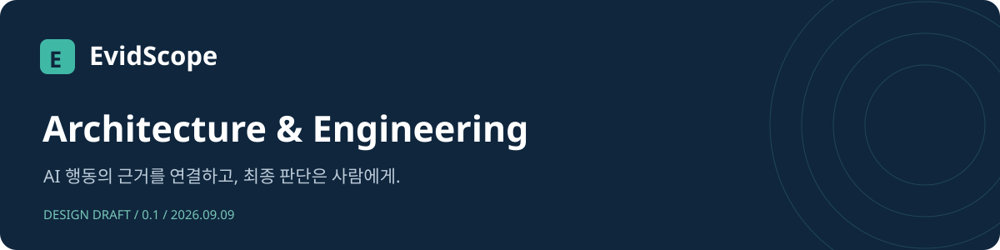

# 문서 안내

**[7쪽 설계·개발 요약서 PDF](../output/pdf/evidscope-design-handbook.pdf)** · **[시스템 구성도 원본 SVG](assets/system-architecture.svg)**

| 구조를 이해하려면 | 개발을 시작하려면 | 현재 범위를 확인하려면 |
|---|---|---|
| [아키텍처 초안](architecture-draft.md) | [개발 가이드](development-guide.md) | [개선 계획](service-improvement-plan.md) |
| 구성·흐름·신뢰 경계 | 실행·모듈·검증·배포 | 완료 조건·비용·다음 단계 |

---

2026-09-09 기준. 처음 읽는 개발자는 아래 순서로 확인한다.

1. [아키텍처 초안](architecture-draft.md): 목적, 구성도, 데이터 흐름, 권한 경계, 배포, 비용 및 다음 설계 과제.
2. [개발 가이드](development-guide.md): 실행, 모듈별 책임, API 개발, UI 원칙, 검증 및 배포 절차.
3. [개선 계획](service-improvement-plan.md): 단계별 범위·완료 조건·비용 원칙.
4. [현재 구현의 위협 모델](architecture.md), [수집·감사 API 계약](contract.md), [운영·복구](operations.md).

## 제품 사용과 지표

- [인간 감사 흐름](audit-workbench.md)
- [에이전트 정책 지표](agent-policy-metrics.md)
- [모니터링 집계·갱신 기준](monitoring-cadence.md)
- [실제 로컬 AI 시험](local-ai-pilot.md)
- [기존 완제품 비교](product-reference.md), [실무 검토 흐름](practitioner-workflow.md)

## 검증과 미완료 범위

- [1차 운영 고도화 결과](../reports/service-improvement-stage1.md)
- [Kubernetes 실제 시험과 실패](../reports/kubernetes-runtime-20260908.md)
- [검증 계획](validation-plan.md), [진행 근거](progress-matrix.md)
- [규정 출처와 미확인 범위](legal-sources.md)

문서 작성일이 모든 시험·법령의 재검증일을 뜻하지 않는다. 각 결과의 날짜·환경·소스 범위를 확인한다. 로컬 AI 시험 완료, Codex 실제 연동, Kubernetes 최신 버전 재배포, 운영 적합성·법률 검토는 별도 상태다.
