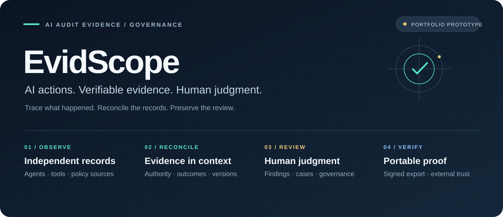

# 문서 안내

**2026-10-06 기준:** 개발 소스 **v0.1.2**, 검증된 이전 로컬 설치본 **v0.1.1**. v0.1.2 반복 검증은 8회 통과 뒤 9회차에 실패했으며 10회 완료가 아닙니다. 버전별 결과와 한계는 [검증 현황](verification-status.md)에 모았습니다.

| 처음 알고 싶은 내용 | 읽을 문서 |
|---|---|
| 어떤 포트폴리오이며 무엇을 해결하는가 | [제품 소개·스택·기능·구현 사례·발전 방향](product-overview.md) |
| 어떻게 구현했고 어디를 신뢰하는가 | [현재 아키텍처](architecture.md), [전체 흐름 SVG](assets/evidence-flow.svg) |
| 실제 성과와 남은 한계는 무엇인가 | [검증 현황과 원본 근거](verification-status.md) |
| 실행·검토·복구 방법은 무엇인가 | [설치·첫 사용](first-release-20261006.md), [v0.1.1 권한 패치](first-release-security-patch-20261006.md) |
| 한국 거버넌스에서 무엇을 지원하는가 | [증거 계약](kr-governance-evidence.md), [공급사 조치 활용](kr-supplier-reliance.md) |

아래 자료와 PDF는 각 작성 시점의 기록입니다. 기존 HTML 뷰어는 2026-09-09 설계를 설명하며 최신 상태는 위 제품·검증 문서를 따릅니다. 과거 문서의 `.local/`, `.test-runs/`, `releases/` 경로는 공개 저장소에 포함하지 않은 로컬 자료입니다.

## 이전 개발 기록과 상세 문서

**v0.1.0 당시 출시 기록:** [설치 안내](first-release-20261006.md) · [출시 결과](../reports/first-release-20261006.md). 이 기록의 756개 전체 검사·380개 반복 검사·Linux 38개는 당시 버전의 결과입니다.

**2026-10-06 한국법 증거 검증 보강:** [한국법 조치 시험·문서·검토 계약](kr-governance-evidence.md) · [법령 확인 범위](legal-sources.md). 조건부 의무와 노력의무를 분리하고 현재 법령·시스템·원본 증거를 대조합니다. 최신 실제 검사 결과는 [검증 보고서](../reports/kr-ai-basic-governance-verification-20261006.md)를 확인하세요.

**2026-09-12 1차 구현:** [기술 가이드](first-release-technical-guide-20260912.md) · [기능 명세서](first-release-functional-spec-20260912.md) · [실행 계획](first-release-execution-plan-20260912.md) · [최신 보안 모델 재검토](security-model-reassessment-20260912.md) · [검증 보고서](../reports/evidscope-v1-verification-20260912.md). 수집·가시성·거버넌스·격리/학습 경로와 UI는 코드로 구현했으며, 실제 모델 선택·가중치 반입·Pod 실측·학습은 아직 수행하지 않았습니다.

**1차 결과물:** [개발 보고서 PDF](../output/pdf/evidscope-first-development-report.pdf) · [포트폴리오 PDF](../output/pdf/evidscope-portfolio.pdf) · [보고서 Markdown](../reports/first-development-report-20260909.md) · [포트폴리오 Markdown](portfolio.md). 실제 화면과 시험 결과, AI 협업의 역할, 미완료 항목을 구분했습니다. 기능 검증 기준은 `300c07f`입니다.

**[클릭하며 읽는 문서 뷰어](viewer.html)** — 서비스 개요 → 구성요소 → 행동 추적 예시 → 개발 → 현재 상태 순서로 읽습니다. 구성요소를 누르면 역할과 한계가 펼쳐지고, 예시는 네 단계로 이동합니다.

저장소를 받은 뒤 `node scripts/preview-docs.mjs`를 실행하고 [로컬 문서 뷰어](http://127.0.0.1:9097/docs/viewer.html)를 여세요. `docs/viewer.html`을 브라우저에서 직접 열어도 됩니다. GitHub의 HTML 링크는 소스 파일을 표시합니다. 뷰어는 외부 라이브러리·API·AI 추론 없이 실행되는 설명용 문서이며, 실제 운영 화면과 구분됩니다. 상세 Markdown 링크는 원문을 엽니다.

**[7쪽 설계·개발 요약서 PDF](../output/pdf/evidscope-design-handbook.pdf)** · **[시스템 구성도 원본 SVG](assets/system-architecture.svg)**

| 구조를 이해하려면 | 개발을 시작하려면 | 현재 범위를 확인하려면 |
|---|---|---|
| [아키텍처 초안](architecture-draft.md) | [개발 가이드](development-guide.md) | [개선 계획](service-improvement-plan.md) |
| 구성·흐름·신뢰 경계 | 실행·모듈·검증·배포 | 완료 조건·비용·다음 단계 |

---

2026-09-09 기준. 처음 읽는 개발자는 아래 순서로 확인한다.

1. [아키텍처 초안](architecture-draft.md): 목적, 구성도, 데이터 흐름, 권한 경계, 배포, 비용 및 다음 설계 과제.
2. [개발 가이드](development-guide.md): 실행, 모듈별 책임, API 개발, UI 원칙, 검증 및 배포 절차.
3. [개선 계획](service-improvement-plan.md): 단계별 범위·완료 조건·비용 원칙.
4. [현재 구현의 위협 모델](architecture.md), [수집·감사 API 계약](contract.md), [운영·복구](operations.md).

## 제품 사용과 지표

- [기능 설명과 경량 모델 중심 비용 설계](feature-guide.md)
- [다중 에이전트 개발·감사·역할 전문화](multi-agent-development.md)
- [로컬 AI 검토 지원의 권한 경계 결정](adr/0004-local-advisory-boundary.md)
- [인간 감사 흐름](audit-workbench.md)
- [에이전트 정책 지표](agent-policy-metrics.md)
- [모니터링 집계·갱신 기준](monitoring-cadence.md)
- [실제 로컬 AI 시험](local-ai-pilot.md)
- [기존 완제품 비교](product-reference.md), [실무 검토 흐름](practitioner-workflow.md)

## 검증과 미완료 범위

- [1차 운영 고도화 결과](../reports/service-improvement-stage1.md)
- [Kubernetes 실제 시험과 실패](../reports/kubernetes-runtime-20260908.md)
- [검증 계획](validation-plan.md), [진행 근거](progress-matrix.md)
- [규정 출처와 미확인 범위](legal-sources.md)

문서 작성일이 모든 시험·법령의 재검증일을 뜻하지 않는다. 각 결과의 날짜·환경·소스 범위를 확인한다. 로컬 AI 시험 완료, Codex 실제 연동, Kubernetes 최신 버전 재배포, 운영 적합성·법률 검토는 별도 상태다.

- [한국법 금융 증거 흐름·API·검증](finance-evidence-20260922.md)
- [로컬 학습 전달 경로와 실측 조건](training-delivery-20260922.md)
- [조직 OIDC 로그인·서명 접근 상태·세션 회수](oidc-authentication.md)
