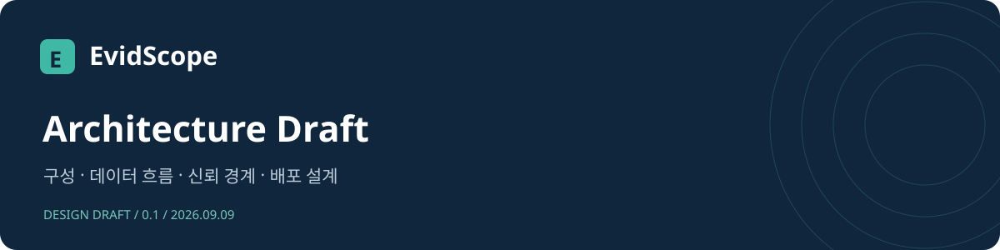
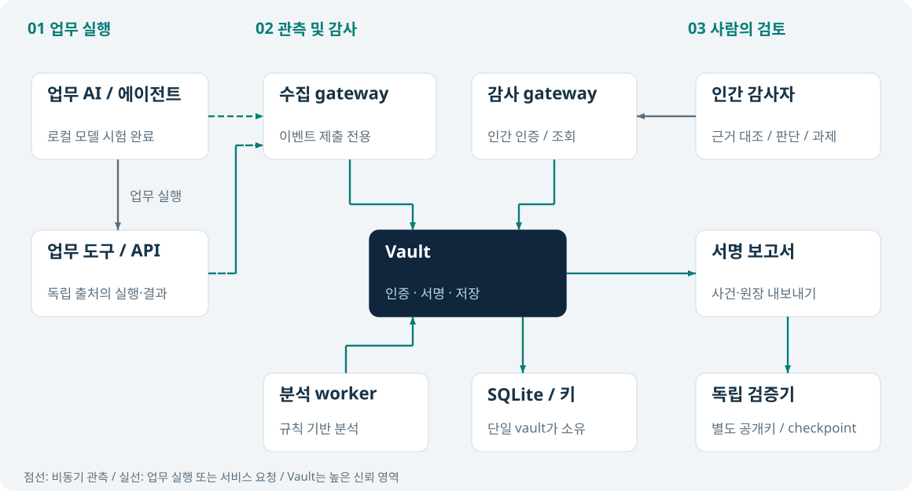
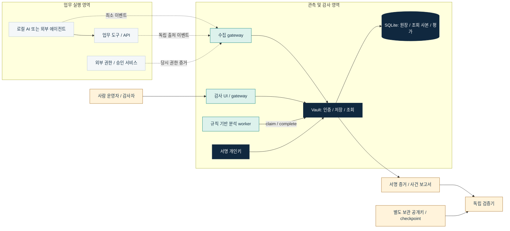
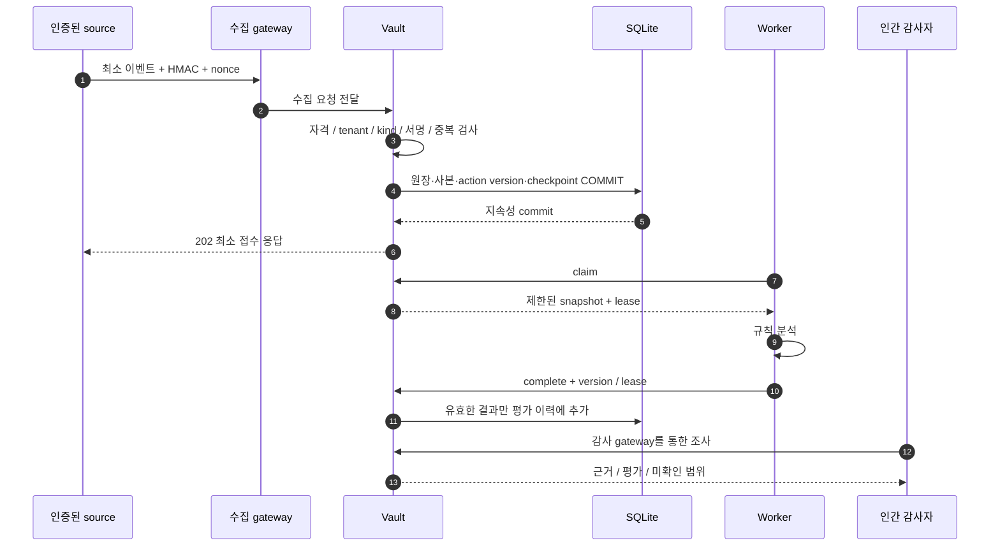
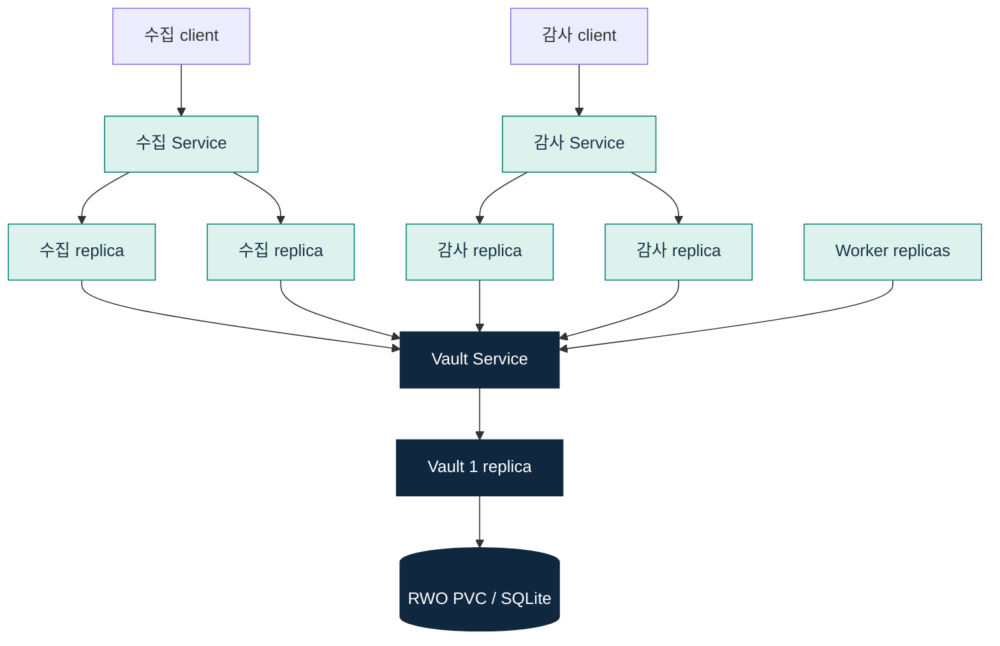

# EvidScope 아키텍처 초안

문서 버전 0.1 · 작성일 2026-09-09 · 대상: 현재 실행 가능한 로컬 파일럿 및 다음 개발 단계. 운영 승인용 최종 설계가 아니다.

| 문서 목적 | 현재 단계 | 설계 원칙 |
|---|---|---|
| 구조·책임·신뢰 경계 검토 | 실행 가능한 파일럿 | 근거 우선 · 인간 판단 · 최소수집 |

**읽기 경로**　[문서 홈](README.md) · [개발 가이드](development-guide.md) · [PDF 요약서](../output/pdf/evidscope-design-handbook.pdf)

---

## 1. 목적과 범위

EvidScope는 AI가 요청한 행동, 독립 도구의 실행·결과, 당시 권한·정책·승인, 참고자료를 연결한다. 운영자와 감사자는 근거를 대조하고 검토 의견·조치 과제·재검토를 남긴다. 미관측·증거 부족은 별도 상태로 유지한다.

업무 도구 중개, 실행 허용·차단, 업무 승인 토큰 발급, 자동 대응은 제품 범위 밖이다. 감사 영역에 증거를 읽는 LLM이나 에이전트 실행기를 두지 않는다. 규정 매핑은 인간의 적용성·법률 검토를 지원한다.

## 2. 시스템 구성

연결 관계 상세 · Mermaid 구성도

점선은 업무 실행 경로 밖의 비동기 관측이다. 현재 로컬 AI 파일럿은 에이전트와 도구가 서로 다른 source 자격을 사용하지만 같은 시험 프로세스에 있으므로 독립 호스트 격리를 입증하지 않는다. Codex 수집기는 아직 구현하지 않았다.

| 구성요소 | 구현 | 책임 | 상태 소유 |
|---|---|---|---|
| 수집 gateway | `src/server.mjs`, MODE=ingress | 수집 경로 제한, 크기·동시성 제한, vault 전달 | 영속 증거 없음 |
| 감사 gateway/UI | MODE=audit, `public/` | 한국어 조사, 그래프, 사건·규정·보존 검토 | 토큰은 탭 메모리 |
| Vault | `src/service.mjs`, `src/store.mjs` | 최종 인증, tenant 경계, 지속성 접수, 인간 API | DB·인증 설정·서명키 |
| 분석 worker | `src/worker.mjs`, `src/analysis.mjs` | 배정된 snapshot의 제한된 규칙 분석 | 작업 lease는 vault DB |
| 독립 검증기 | `src/crypto.mjs`, `src/report-verifier.mjs` | 원장·사건 서명 및 commitment 검증 | 별도 신뢰 앵커 입력 |
| 로컬 AI 시험 | `scripts/local-ai-test.mjs` | 합성 자료 조회·실제 모델 도구 호출 | 운영 감사 API 권한 없음 |

## 3. 수집과 분석 흐름

- `202`는 DB commit 완료이며 분석 완료·외부 봉인 완료와 다르다.
- 응답 timeout은 접수 여부가 불명확하다. 같은 이벤트 ID·내용과 새 nonce로 재시도한다. 같은 ID의 다른 내용은 거부한다.
- source SDK 큐는 메모리 기반·유한 크기다. 수집 실패가 업무를 무한 대기시키지 않으며 drop/retry 지표가 있다. 프로세스 종료 시 큐 보존을 보장하지 않는다.
- 새 증거·정책 변경·예외 만료는 분석 version을 갱신한다. 오래된 lease 결과는 최신 평가를 덮어쓰지 못한다.

## 4. 데이터 모델과 식별

| 데이터 | 의미 | 변경 원칙 |
|---|---|---|
| `ledger`, `checkpoints` | tenant별 서명된 연속 원장 | 기존 기록 overwrite 금지, 새 사실 추가 |
| `events` | 최소화된 수신 이벤트 조회 사본 | 검증된 원장에서 재구축 가능 |
| `actions` | 행동별 증거·분석 version | 새 증거와 정책 변경에 따라 증가 |
| `evaluations` | 분석 이력 | 과거 결과 보존 |
| `objects` | 자산·룰·예외·사건·인간 판단·규정 검토 | 변경 사실은 원장에도 기록 |
| `event_keys`, `receipts` | 이벤트 암호키·중복 방지 영수증 | 승인된 파기 후 재전송 복원 방지 |

상관분석은 source들이 합의한 `actionId`와 `traceId`를 사용한다. 에이전트 목록은 tenant 안의 인증된 source와 보고된 actor를 조합한다. 보고된 actor가 실제 워크로드 신원을 증명하지는 않는다. 여러 에이전트가 같은 행동을 주장하면 미확인으로 표시한다.

## 5. 신뢰 및 권한 경계

- Source는 허용된 유형의 이벤트만 제출한다. 조회·export·룰·서명키 접근과 독립 출처 사칭을 거부한다.
- 인간 계정은 자신의 tenant 범위에서 조사한다. 룰·예외 승인과 파기에는 별도의 역할 및 작성자 분리 조건이 있다.
- Worker는 claim된 자료만 받아 분석한다. 감사 판단·법률 판정·실행 승인 권한이 없다.
- Vault 및 DB·키 운영자는 높은 신뢰 주체다. 같은 관리자 또는 호스트 침해에 대한 완전한 독립성을 주장하지 않는다.
- 출처 인증, 외부 효과 확인, 기록 무결성은 서로 다른 보장이다. 서명은 거짓 원천 기록을 참으로 만들지 않는다.

세부 위협·보존 경계는 [아키텍처와 위협 모델](architecture.md), 역할·요청 형식은 [API 계약](contract.md)을 따른다.

## 6. 가시성 지표의 의미

관측 정책 준수율 = 충족 행동 / (충족 행동 + 위반 신호 행동). 미확인·평가 대기·예외는 분모에서 제외하되 각 개수와 평가 범위를 함께 표시한다. 판정 가능한 행동이 없으면 산정 불가다.

기간 조회는 첫 보존 에이전트 수신 시각으로 행동을 선택하고 기간 밖 연관 근거까지 현재 평가에 사용한다. 추이 그래프는 수신 구간별 현재 평가이며 과거 당시 점수 변화가 아니다. 목록에서 상세로 이동할 때 종료 시각을 유지한다. 기본 전체 모니터는 최근 1시간, 1분 집계·갱신이며 이는 사건 탐지 SLA가 아니다.

## 7. 배포와 장애 경계

수집·감사·worker는 확장 대상이며 vault는 단일 writer다. stateless replica 증가가 저장소 HA를 제공하지 않는다. 현재 실험은 Service 내부 분산이며 외부 LoadBalancer 제공자를 설치하지 않는다.

전용 실험 클러스터에서 Service 분산, HPA 증감, Pod 재생성 및 저장 기록 유지가 관측됐다. 장애·부하 timeout도 있었다. CNI 거부 응답과 규칙은 확인했으나 개별 패킷 귀속 검증은 미완료다. 최근 UI 기능 전체를 Kubernetes에 재배포한 상태로 주장하지 않는다. [실측 보고서](../reports/kubernetes-runtime-20260908.md) 참조.

## 8. 비용 및 설계 결정

| 결정 | 이유 | 재검토 조건 |
|---|---|---|
| Node 내장 기능과 정적 UI | 한 사람이 유지할 수 있는 낮은 의존성 비용 | 동기 DB 조회 지연·UI 유지보수 부담 증가 |
| SQLite 단일 vault | 접수·중복·원장·작업 상태의 원자성 | writer 포화, 저장소 HA 요구 |
| 규칙 기반 분석 | 설명 가능한 조건과 재현성, 상시 모델 요금 없음 | 사람이 승인한 추가 분석 요구 발생 |
| 로컬 모델로 필요한 시험만 실행 | 외부 API 요금 없이 기능 확인 | 실제 업무 품질·처리량 부족이 실측될 때 |
| 기본 prompt/response 미수집 | 최소수집·노출면 축소 | 명시적인 목적·보존·접근 통제가 승인될 때 |

로컬 실행에도 CPU·메모리·저장소·전력·운영 비용은 있다. 모델 실행기 분리는 유료 모델 도입을 뜻하지 않는다.

## 9. 다음 설계 과제

소유자·목적·정책 연결을 가진 에이전트 등록 관리, 로컬 시험 프로세스 격리, Codex 실제 수집기, 대규모 집계와 상세 API 페이지화, 외부 신뢰 checkpoint, 백업 복구·SSO·키 회전·저장소 HA를 순서대로 검증한다. [개선 계획](service-improvement-plan.md)의 단계별 완료 조건을 적용한다.
