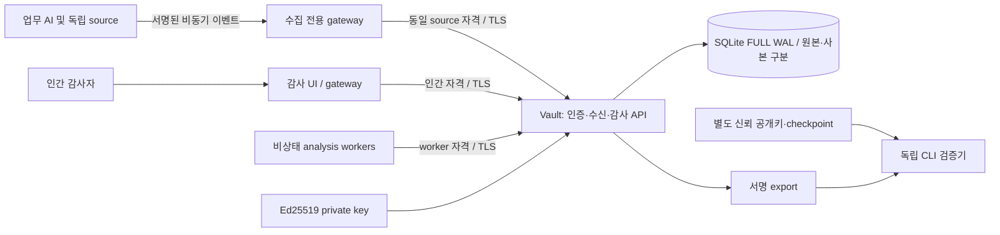

# 아키텍처와 위협 모델

## 선택 이유

한 사람이 유지하는 저비용 파일럿을 위해 Node 24.15 + 내장 HTTP/TLS/SQLite/Ed25519와 정적 한국어 UI를 선택했다. npm 공급망과 별도 broker/search cluster를 초기 도입하지 않았다. SQLite 트랜잭션이 접수 저널, 중복 키, 분석 queue 변경을 원자화한다. 중앙 vault와 비상태 gateway/worker 구조는 수집 API·감사 UI·원본 저장 권한을 구분하며 유지비를 줄인다. 비용은 저장 용량/보존, 서명 CPU, 감사 조회와 단일 writer I/O에 집중된다.

Node API [SQLite](https://nodejs.org/docs/latest-v24.x/api/sqlite.html)는 동기 실행이며 이 버전에서 실험적이다. WAL+FULL은 commit 시 WAL을 동기화한다. 실제 디스크·OS의 fsync 보장, 정전·손상 복구는 별도 검증이 필요하다. [SQLite synchronous 설명](https://www.sqlite.org/pragma.html#pragma_synchronous)

## 신뢰 경계

| 주체 | 할 수 있는 일 | 할 수 없는 일 |
|---|---|---|
| Source | 인증된 tenant·sourceKind에 맞는 이벤트 제출 | 원본/검색/export/룰/사건/키 조회, tenant 선택, 독립 출처 사칭 |
| Auditor | 자신의 tenant 조사, 사건·거버넌스 평가, 예외 요청 | source 승인 발급, 원본 overwrite, 룰 배포 |
| Reviewer | 인간 기능 + 룰 작성·시험·다른 작성자의 룰/예외 승인 | 자기 룰 승인, 자기 소유 예외 단독 승인 |
| Admin | reviewer + 검색 사본 재구축 | HTTP로 원본 덮어쓰기·삭제·서명키 읽기 |
| Worker | `/internal/claim`으로 배정된 자료만 받아 deterministic 분석, `/internal/complete` 제출 | 인간 조회 API, 자의적 tenant 선택, 사건/법률 판단, 실행 승인 |
| Vault 프로세스/운영 관리자 | 원본·키를 운영하는 높은 신뢰 영역 | 별도 통제 없이 침해 내성을 보장할 수 없음 |

Kubernetes에서는 config/서명키/PVC는 vault에만 mount, worker는 worker token, gateway는 TLS 자격만 보유한다. gateway는 사용자 자격을 전달하고 vault가 최종 인증한다. NetworkPolicy로 수집·감사·worker 경로를 나눈다. 동일 노드/cluster administrator/OS 사용자 침해는 독립 trust anchor와 외부 보존 통제를 요구한다. namespace나 Pod만으로 완전 격리되는 것은 아니다. [Kubernetes multi-tenancy](https://kubernetes.io/docs/concepts/security/multi-tenancy/)

로컬 개발은 한 OS 사용자 아래 여러 프로세스이며 운영 AI가 같은 OS 사용자 파일 접근 권한을 갖는 위협까지 격리하지 않는다. 합성 파일 자격·공개 테스트 자격은 운영에 재사용하지 않는다. 외부에 접근 가능한 UI는 SSO/MFA, 토큰 회전·회수, TLS 및 접근 관리를 운영 설계에 추가해야 한다. 인증된 source 시스템 자체의 거짓 기록은 암호만으로 해결되지 않는다.

## 증거 의미와 지속성

`ledger`는 tenant별 연속 sequence, previous hash, 정규화 JSON digest를 갖는 append-only 원장이다. 새 이벤트 내용은 AES-256-GCM 개별 키로 암호화하고, 서명 원장에는 암호문·내용 commitment·action 식별자·기간을 저장한다. DB trigger는 앱 실수로 인한 UPDATE/DELETE를 거부한다. append는 기존 서명 checkpoint와 head를 비교하여 손상된 head를 다시 봉인하지 않는다. DB 파일/프로세스 권한을 가진 공격자에 대한 WORM은 아니다. 원본이라고 부르는 것은 수신 시 검증·최소화한 메타데이터이며 원문 prompt나 raw transport body가 아니다.

서버가 HMAC·시각·nonce·출처 권한을 검증한 후 허용 필드만 원장에 기록한다. 출처 ID/tenant/kind는 자격 파일에서 결정된다. 원문 transport body는 서명 검증에 일시 사용한 뒤 보존하지 않는다. 사후 원문 HMAC 재검증은 불가능하며 vault의 수신 검증 주장과 원장 무결성을 검증한다.

접수 이벤트, 검색 사본, action dirty version, nonce, checkpoint를 `BEGIN IMMEDIATE`→`COMMIT` 트랜잭션에 넣는다. **202는 COMMIT 뒤 반환**한다. 네트워크 timeout은 성공/실패 불명일 수 있으므로 같은 event ID, 새 nonce로 재전송한다. 같은 source+tenant+ID와 같은 내용은 중복 접수; 내용 변경은 409. 다른 tenant/source의 동일 ID는 별개의 자격 공간이다.

각 commit의 Ed25519 checkpoint는 마지막 해시·개수·tenant를 서명한다. export는 축약 없이 원장 전체와 checkpoint를 포함하며 외부 키로 검증한다. 악의적인 일부 추출·내용 변조·순서 변경은 검출된다. 유효하게 서명된 과거 export rollback은 별도 최신 checkpoint가 있어야 검출된다. 키·원본·checkpoint가 함께 침해되거나 독립 출처가 거짓인 경우 내용 진실성을 보장하지 않는다. 공개키를 동일 침해 영역에서만 가져오지 않는다. [Node Ed25519 sign/verify](https://nodejs.org/docs/latest-v24.x/api/crypto.html)

조회용 `events`, 평가 `evaluations`, 인간 작업 `objects`는 서로 구분된다. 원장은 관리 변경 및 조회/export도 기록한다. 접근 감사는 source ingestion을 재호출하지 않아 무한 수집 루프가 없다. 검색 사본은 원장 무결성 확인 후 다시 생성한다. worker는 durable 30초 lease와 snapshot hash를 받아 프로세스 밖에서 계산하고 version/lease 일치 결과만 transaction으로 확정한다. worker 장애·늦은 결과·정책 변경은 만료/충돌로 처리한다. 새 증거/룰/예외 승인/예외 만료는 과거 평가를 남기고 새 평가를 추가한다. 원장 streaming 검증은 전체 배열 대신 제한된 사건과 정책 자료만 모은다. 이벤트 1,000개/10MiB snapshot 한도 초과는 격리 상태와 backlog로 남기며, findings 100개 초과는 반환 범위·전체 수를 명시한다.

## 관측과 분석의 한계

기본 탐지는 미등록 자산, 목적지 정책, 권한·인간승인 부족/범위 불일치, 위임 미확인, 상충하는 동일 대상 결과, 중단 미확인, 수집 공백/늦은 증거, 로그 인젝션 의심이다. 권한 scope는 actor/tool/action/resource 필수 일치, 정책 버전·발급 시각·유효기간·철회·parent 범위를 대조한다. 취소 token이나 실행 허가를 발급하지 않는다. 중단 확인과 실행 결과는 별개의 상태다.

모든 실행에 권한/사람승인을 찾는 기본 룰은 감사 확인 요구이며 모든 업무에 법적으로 사람승인이 필요하다는 판정이 아니다. 조직별 false positive는 근거 있는 한시 예외로 관리한다. 허용 사용자 룰은 8개 필드의 eq/neq/contains, 최대 200자 값, 100개 룰이다. regex/eval/network/tool 실행은 없다. 테스트는 최근 1,000건으로 제한하고 범위를 표시한다.

상관분석 키는 source들이 합의한 actionId/traceId다. 강한 global action identity나 공급자별 실제 schema adapter는 아직 없다. 현재 sourceKinds는 기능 범주이며 공급자 실연동 완료를 뜻하지 않는다. clock 오차 5분 및 late 5분 기준은 공학적 기본값이다. source heartbeat/최근 수신은 연결 상태를 말할 뿐 전체 사용의 분모를 제공하지 않는다. OpenTelemetry GenAI 규약은 참고했으나 직접 호환 adapter라고 주장하지 않는다. [공식 GenAI 규약](https://opentelemetry.io/docs/specs/semconv/gen-ai/)

단일 vault를 복제하지 않는다. API와 worker replica 증가가 SQLite writer나 검색 병목을 없애지 않는다. 분석 계산은 별도 worker로 이동했지만, vault의 서명·무결성 전수 순회 및 저장 CPU/I/O는 여전히 병목이다. 두 실제 프로세스의 lease 정합성과 원자적 commit을 시험했다. 2026-09-08 Kubernetes 실험에서 HPA 증감과 확장 후 새 Pod 참여를 관측했다. 부하 도중 새 Pod는 아직 Ready가 아니었으므로 확장에 따른 본 부하 처리량 개선은 입증하지 않았다. reports/kubernetes-runtime-20260908.md에 실패와 범위를 보존했다. 감사 검색/대규모 export에는 전체 원장·사본 스캔 및 메모리 상한 한계가 남아 있다.

## 개인정보·비신뢰 내용·보존

prompt/response/secret/임의 payload/URL fetch는 수집 계약에 없다. note 등 메타데이터에도 개인정보를 넣지 않아야 한다. 필드 허용목록만으로 모든 의미적 비밀 유출을 탐지할 수 없으며 예외 원문 수집은 현재 지원하지 않는다. 조직은 source 전송 전 최소화·가명화·승인된 목적·보존 근거를 정해야 한다.

UI는 외부 텍스트를 DOM textContent로 표시하고 CSP로 inline script/object/frame을 차단한다. export는 JSON attachment만 제공하여 CSV 수식 실행 경로를 만들지 않는다. 제어문자/방향 제어문자와 초과 payload를 거부한다. 외부 참조는 표시용이며 자동 URL 조회를 하지 않는다. 로그 속 지시가 룰·권한·개발 명령으로 실행되는 경로는 없다. 문자열 탐지는 의미적 prompt injection 해결의 증명이 아니다. [OWASP 공식 지침](https://cheatsheetseries.owasp.org/cheatsheets/LLM_Prompt_Injection_Prevention_Cheat_Sheet.html)

보존 정책은 목적·사유·검토자·버전을 기록하고 새 이벤트에만 적용한다. 기본30일은 합성 파일럿의 공학적 선택이며 법적 기간이 아니다. 기간 종료, 보존 hold, 미종결 사건을 확인해 구체적 파기 계획을 만들고, 다른 검토자 승인 후 관리자가 명시 실행한다. 승인 후 hold가 추가되면 실행을 거부한다. 실행은 live 이벤트 키·검색 사본을 제거하고 원장에 서명된 파기 내역을 남긴다. 개별 이벤트 영수증을 남겨 재전송으로 삭제한 내용을 되살리지 않는다. 무단 키 누락과 정당한 파기를 검증기에서 구별한다.

파기한 내용은 재조사할 수 없다. export v2는 보존 중인 이벤트의 공개 내용(disclosures)을 commitment와 대조하고, 파기된 이벤트는 정당한 파기 원장 참조만 검증한다. 기존 export, backup, WAL·물리매체의 잔존 키, 인간이 의견/평가/문서에 복제한 내용까지 삭제했다는 보장은 아니다. 이전 v1 평문 원장은 별도 migration/보존 절차가 필요하다. 이 실제 합성 시험을 운영 개인정보 파기 완료 또는 전 범위 삭제 보장으로 확대하지 않는다.

## 사람이 비교하는 행동·참고자료 가시성

행동 상세는 요청/AI 자기보고, tool 실행, tool 결과, 권한/검토, 참고자료를 함께 표시한다. `dataRefs`는 자료 ID·유형·버전·SHA-256·입력/검색/출력 역할·위치의 최소 메타데이터다. 제출자가 독립 확인 상태를 설정할 수 없고 source 자격에 따라 `self_reported_reference`와 `service_reported_reference`로 표시한다. 자료 참조가 있다는 사실은 모델이 실제 읽거나 판단에 사용했다는 증명이 아니다. 모델 내부 사고·학습 데이터 전체를 추측하지 않는다.

합성 사례는 AI가 product-guide v2를 참고했다고 보고하지만 tool 기록은 v1을 참조한 상황이다. 두 실제 합성 파일의 SHA-256과 출처를 나란히 비교하고, 자료 참조가 없으면 미수집 상태를 유지한다. 동일 행동의 version/hash 충돌은 조사 경보이며 악의의 자동 판정이 아니다. 제품 문서에서 참고한 방식과 재사용 경계는 [완제품 조사](product-reference.md)에 기록했다.

## 법적 판단과 운영 한계

규정 catalog hash와 요구사항 snapshot, 시스템 사실관계 hash, 담당자, evidence refs/버전, 통제, 기술 상태, 충분성, 법적 검토, 재검토 일자를 보존한다. 시스템/규정 변경은 과거 평가를 보존하면서 보완 과제를 만든다. 문서 링크의 실재/서명/내용은 인간 참조이며 자동 검증하지 않는다. 충분성은 인간이 남긴 평가이고 규정 준수 증명서가 아니다. 한국 고영향/EU 고위험은 별도 입력이다.

최종 한국 고시 일부 미확인, ISO 본문 미확보, 운영 KMS/WORM/SSO/백업 HA/공급자 실연동/법률 검토 미완료. Kubernetes static package와 실제 cluster 검증을 구분한다. 구현에 없는 기능을 배포 설정이나 면책 문구로 충족됐다고 표시하지 않는다.
