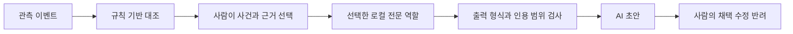
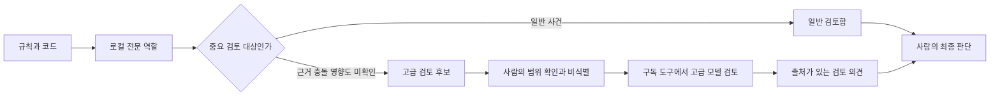

# EvidScope 기능과 비용 설계

EvidScope는 에이전트의 행동·참고자료·권한·결과를 연결해 사람이 판단하도록 돕는 로컬 감사 지원 파일럿이다. 개발팀의 에이전트 협업을 관측하는 기능과, 서비스에서 로컬 AI가 검토 초안을 작성하는 기능을 함께 제공한다. 현재는 사람이 사건과 역할을 선택해 실행한다. 모든 운영 역할을 자율적으로 순서 배정하거나 중요 사건을 고급 모델에 자동 전송하는 기능은 아직 구현하지 않았다.

## 두 종류의 에이전트 팀

| 구분 | 구성 | 현재 실제 동작 |
|---|---|---|
| 제품 개발팀 | Astra 설계·검토, Sol 핵심 구현, Claude UI | 역할별 작업 명세와 worktree, 인수인계, 별도 감사. 등록 작업의 동시 실행 상한은 coordinator 포함 3개 |
| 서비스 운영 역할 | 증거 정리, 근거 대조, 거버넌스 지원, 보고서 초안 | 공통 로컬 Qwen3 4B에 역할별 지침·지식·출력 계약 적용. 사용자가 사건 하나와 역할 하나를 선택해 실행 |

개발용 고급 모델이 서비스를 계속 분석하는 구조는 아니다. Codex와 Claude 실행 이벤트는 내용·내부 사고 과정을 제외한 허용 메타데이터로 수집한다. 운영용 모델도 테스트나 명시적 사건 분석 때만 실행하고, 시험 종료 후 중지한다.

## 지금 사용할 수 있는 기능

1. **행동 조사:** AI 자기보고와 도구 실행 결과, 승인·권한 기록, 참고자료 ID·버전·해시를 대조한다. 성공 보고와 실패 결과처럼 서로 다른 출처의 기록을 함께 보여 준다.
2. **에이전트 목록과 시간축:** 에이전트별 관측 정책 준수율, 평가 범위, 미확인·재검토 현황을 조회한다. 주식형 시간축의 확대·이동·최신 따라가기와 목적별 집계를 지원한다.
3. **개발팀 실행 관측:** 팀·역할·실행·부모 관계·도구 메타데이터·실패·사용량을 기록한다. 관측되지 않은 부모나 모델 정보는 확인된 것처럼 채우지 않는다.
4. **로컬 AI 검토:** 사람이 선별한 사건 자료를 고정하고, 실행 하나에 한정된 자격으로 모델에 전달한다. 네 역할의 지침과 출력 계약이 실제 실행 묶음에 들어간다.
5. **기계 초안과 사람 판단 분리:** 초안의 채택·수정·반려 기록은 기존 사건 판단이나 정책 점수를 덮어쓰지 않는다. 새로운 사건·증거·규정 문맥이 생기면 최신성 확인이 필요하다.
6. **평가와 학습 준비:** 역할별 60개, 총 240개의 합성 사례와 구조화된 검사기를 제공한다. 모두 `UNREVIEWED`이며 학습 완료나 검증된 정답 자료로 취급하지 않는다.

이 그림은 현재 실행 흐름이다. 역할들이 서로 작업을 자동 위임하는 팀 실행기로 해석하지 않는다.

## 검증 에이전트와 검사기의 역할

개발팀에는 구현 문맥과 분리된 고급 모델 감사 역할이 있다. 첫 Astra 감사는 별도 재현 검사로 결함을 보고했다. 이후 수정에 대한 독립 재감사 완료 여부는 최신 시험 보고서에서 따로 확인한다.

서비스의 `근거 대조` 역할은 자료 사이의 일치·불일치·미확인을 정리한다. 다만 다른 역할의 출력을 자동으로 받아 독립 승인하는 검증 에이전트로 연결되지는 않았다. 현재 코드 검사는 출력 구조, 인용의 소속 범위, 버전·해시, 작업 자격과 상태를 확인한다. 인용 ID가 존재한다는 사실만으로 주장의 의미적 타당성을 증명하지 못한다. 실제 Qwen 시험에서 이 차이가 드러났고 해당 초안은 시험상 반려했다.

## 비용을 줄이는 목표 구조

작업 난도와 영향도에 따라 필요한 계산만 사용한다. 모델이 표시한 자신감만으로 고급 검토 여부를 결정하지 않고 근거 충돌·권한 문제·자료 부족·사건 영향도를 함께 확인한다.

| 단계 | 담당 | 맡길 일 | 현재 상태 |
|---|---|---|---|
| 1 상시 관측과 정형 검사 | 코드와 규칙 | 수집·중복·권한·버전·형식·정책 대조 | 구현 |
| 2 일반 자료 정리 | 로컬 경량 모델의 전문 역할 | 출처 정리, 주장 대조, 누락 표시, 보고서 초안 | 단일 역할 실행 구현 |
| 3 중요 사건 선별 | 규칙과 인간 검토 | 고위험 신호, 근거 충돌, 법적 적용성 미확인, 유보·반복 실패 | 사람이 사건을 선택하는 단계. 자동 선별 큐는 후속 구현 |
| 4 정밀 검토 | 고급 모델의 별도 검토 세션 | 복합 원인 분석, 반례 검토, 중요한 설계·감사 | 개발 감사에서 사용. 운영 사건 자동 호출은 비활성 |
| 5 최종 판단 | 지정된 사람 | 자료 충분성, 적용성, 채택·수정·반려와 후속 과제 | 인간 검토 흐름 구현 |

이 그림은 발전 목표다. 자동 선별 큐, 운영 역할의 순차 팀 실행, 고급 검토 결과의 자동 가져오기는 아직 구현 완료 기능이 아니다.

추가 API 예산은 **0원**으로 시작한다. 고급 검토는 사람이 확인한 최소 자료를 기존 구독 도구로 전달하는 절차로 운영한다. 서비스가 유료 API로 자동 전환하거나 구독 세션을 무단으로 재사용하지 않는다. 구독 한도 소진 시 대기하고 크레딧·GPU 임대로 넘어가지 않는다. 로컬 전력, 보유 장비, 기존 구독료와 사람의 검수 시간은 별도 비용이다.

가격 경쟁력은 앞으로 동일한 사건군에서 `전체 사건 수`, `로컬 처리 수`, `고급 검토 수`, `재작업 횟수`, `확인 가능한 사용량`, `사람의 수정 시간`을 함께 측정해 판단한다. 아직 고급 호출 감소율이나 비용 절감률을 실측했다고 주장하지 않는다. 미확인 사용량은 0으로 환산하지 않는다.

## 전문화는 단순한 모델 이름 변경과 다르다

각 역할은 `roles/<역할>/v1`에 목적·지침·허용 도구 선언·지식 범위·출력 계약·유보 조건·평가 세트를 가진다. 실제 실행 묶음에는 이 역할 내용과 해시가 고정된다. 선언된 도구 이름은 실행 권한을 부여하지 않으며 현재 모델은 업무 도구를 실행하지 않는다.

LoRA는 사람 검수 학습 300개·검증 50개·시험 100개 등의 진입 조건을 충족한 뒤 증거 정리 역할부터 검토한다. 현재 인간 검수 수는 0개로 학습 진입이 차단돼 있다. 합성 시험 통과, 지침 조정, 가중치 학습, 실무 품질 승인은 별도 상태다.

## 실행과 확인 자료

- [초기 실행 안내](../README.md#실행)
- [개발팀 운영과 수집 API](development-agent-operations.md)
- [로컬 AI 지원 계약](assistance-contract.md)
- [역할과 모델 배치 계획](multi-agent-development.md)
- [1차 개발 보고서](../reports/first-development-report-20260909.md)
- [포트폴리오 소개서](portfolio.md)

이전 초본 PDF의 검증 기준은 `300c07f`다. 이후 통합 기능과 최종 시험 결과는 이 문서 및 업로드 직전 검증 보고서를 함께 읽는다. 운영 인증·법률 준수 확인·저장소 HA·전체 모델 품질 검증은 별도 완료 조건이다.
