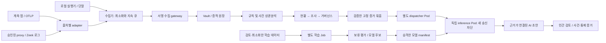

# EvidScope 1차 완성본 실행 계획

작성일: 2026-09-12 · 상태: 1차 코드 구현 및 합성·무모델 시험 진행, 실제 모델 선택·가중치 반입·Pod 실측·학습은 대기

목표는 **관리 대상의 로컬·사내망 AI 사용을 발견하고, 행동·권한·증거를 연결해 의심 사건과 거버넌스 검토로 이어지는 감사 서비스**다. 기존 Node/SQLite·서명 원장·한국어 UI를 확장하고, 격리된 오픈 모델은 근거 정리와 조사 제안을 담당한다. 이번 문서는 마지막 요청에 따라 실행 계획을 정리한 산출물이다.

추가 요구를 필수 조건으로 반영한다: 최신 보안 특화 가중치 모델의 벤치마크·사용자 경험·라이선스를 비교한 뒤 **사용자가 선택한 모델만 사용**한다. 초기 추론 자원을 제한하고 개발·테스트 종료 직후 끈다. 모델은 독립 Pod에 두고 사용자 업무 파일을 직접 읽거나 쓰는 도구·mount·자격을 제공하지 않는다.

## 1. 현재 구현에서 출발할 지점

| 영역 | 현재 코드·자료에서 확인한 것 | 이번 확장 |
|---|---|---|
| 증적과 조사 | 서명 수집, tenant 분리, append-only 원장, 독립 export 검증, 사건·룰·보존 관리 | 기존 신뢰 경계를 유지하며 실제 수집기와 관측 범위를 연결 |
| AI 가시성 | 행동·자료 참조·권한·결과 대조, 에이전트 집계, 시계열·수집 건강 | 자산 목록, 수집기 상태, 출처 간 연결, 미관측·추정 구분 |
| 실제 연동 | 로컬 Qwen 합성 시험, 개발 도구 이벤트 변환기 존재 | 상시 실행 가능한 제한된 collector와 OTLP·네트워크 로그 adapter |
| 거버넌스 | 요구사항 20개, KR/EU 분류 분리, 증거·인간 평가·재검토 이력 | 한국 법·국제 프레임워크 범위 확장, 출처 검증 상태와 적용성 개선 |
| AI 감사 지원 | `qwen3:4b` 고정 Ollama 실행기, run 전용 자격, 제한된 JSON 초안 | 검증한 모델 manifest, 격리 Pod, 성능 비교, 학습 후보 관리 |
| 가중치 학습 | LoRA 후보 설정과 admission gate만 존재 | 검토 데이터·학습 Job·평가·승격·rollback을 연결 |
| UI | 13개 메뉴와 기존 차트·사건 조사 흐름 | 업무 중심 6개 메뉴, 공통 필터와 근거 상세 패널 |

근거: [아키텍처](architecture.md), [수집 계약](contract.md), [기존 개선 계획](service-improvement-plan.md), [개발 이벤트 수집기](../src/development-collectors.mjs), [감사 지원 실행기](../src/assistance-runner.mjs), [LoRA admission](../src/role-evaluation.mjs).

2026-09-09 감사 보고서의 A1~A3에 대응하는 원장 대조·사건 변경·timeout 영속화 코드와 회귀 테스트가 현재 존재한다. 이번에 테스트를 다시 실행하지 않았으므로 최신 통과로 간주하지 않고 첫 단계의 회귀 대상으로 삼는다. A4~A5인 **전송 묶음 전체 미리보기 누락, 사람이 수정해 채택한 문안 표시 누락**은 현재 UI에서도 확인되어 우선 수정한다. [기존 감사 보고서](../reports/astra-adversarial-20260909.md)

현재 장비를 읽기 전용 명령으로 확인했다: Windows x64, Node 24.15.0, 논리 CPU 20개, RAM 32GiB, RTX 3080 VRAM 12GiB. Docker daemon에는 연결되지 않았고 Docker 설정·기본 kubeconfig 접근도 제한됐다. GPU의 컨테이너 전달, CNI, 현재 클러스터 상태는 미확인이다. 이 계획 작성 중 자원 시작이나 설정 변경은 하지 않았다.

## 2. “모든 AI 사용 감사”의 구현 가능한 범위

전체 사용을 추적하려면 먼저 관리 대상 단말·서버·워크로드·네트워크 구간을 등록해야 한다. **등록 자산의 관측 상태는 빠짐없이 표시하되, 미관측 사용까지 감지했다고 계산하지 않는다.** 사내망 수집 지점에 도달하지 않는 단말, 암호화된 웹 대화, 설치되지 않은 로컬 실행기를 네트워크 로그만으로 확정할 수는 없다. Zeek도 TLS 연결의 메타데이터와 암호화된 내용 분석을 구별한다. [Zeek TLS 로그](https://docs.zeek.org/en/lts/logs/ssl.html), [TLS 복호화 조건](https://docs.zeek.org/en/lts/frameworks/tls-decryption.html)

| 관측 경로 | 1차 제공 기능 | 해석과 공백 |
|---|---|---|
| 로컬 AI/개발 도구 | 기존 이벤트 변환기 재사용, 지정 실행 로그·hook·Ollama 호출 계측 | 연결한 실행기의 요청·도구·결과만 추적. 모델 설치 자체는 사용 증거가 아님 |
| 사내 앱/API | OTLP/HTTP 수신 및 GenAI span 메타데이터 정규화 | 계측된 호출은 실행 증거. sampling/drop을 별도 표기 |
| 사내망 AI 서비스 접근 | 승인된 proxy 로그 또는 Zeek conn/dns/tls JSON 로그 수집 | 알려진 AI 목적지 접근은 후보 신호. 대화 내용·정확한 모델·사용자 의도는 미확인 |
| 단말·워크로드 목록 | 관리 자산 등록, source 연결, 마지막 수신, 기대 heartbeat, 수집 오류 | 연결·부분 관측·오래됨·미설치·범위 밖을 분리 |
| 브라우저 AI/SaaS | 기존 네트워크 관측과 서비스 제공 audit 로그가 있으면 연결 | 웹 접근과 AI 생성 요청을 구별. 별도 audit API가 없는 서비스는 메타데이터 수준 |

첫 실증 범위는 이 PC의 로컬 실행기 1개, 계측한 테스트 앱 1개, 사내망 테스트 단말/서버의 네트워크 로그 source 1개다. 실제 망 연동 없이 replay만 성공하면 상태를 `adapter 검증`으로 남기고 `실제 망 감사 완료`로 올리지 않는다. 추가 OS·SaaS는 같은 수집 계약을 따르는 connector 단위로 늘린다.

노출할 분모는 세 가지로 분리한다: ① 등록 자산 중 collector가 연결된 자산, ② source가 보고한 발생량 대비 수신량, ③ 수신된 행동 중 필요한 증거가 갖춰진 행동. 각 분모의 출처·기간·미확인을 함께 표시한다. heartbeat 정상이나 이벤트 0건을 전체 사용 가시성 100%로 바꾸지 않는다.

## 3. 수집·감사 구조



수집과 규칙 평가에는 LLM을 호출하지 않는다. AI 감사는 사람이 선택한 사건 또는 조직이 명시한 탐지 조건·횟수 상한 안에서만 실행한다. 자동 분석을 켜더라도 증거 원장, 법률 판단, 정책 승인, 사건 종결 권한을 모델에 주지 않는다. 감사 모델 자신의 실행도 별도 목적의 메타데이터로 기록해 추적하되 자기 기록으로 재귀 호출되지 않게 한다.

### 계약과 저장 변경

- `src/client.mjs`의 메모리 큐 한계를 보완하는 collector 전용 지속 큐를 추가한다. 최소화 후 저장, tenant/source별 분리, 크기·기간 상한, 재시도 지연, 202 뒤 ACK, 재시작·로그 회전 cursor, 유실 계수·dead letter를 설계한다. 업무 호출은 수집 ACK를 기다리지 않는다.
- 기존 v1 수집은 보존하고 버전이 명시된 관측 schema를 추가한다. 제안 필드는 `schemaVersion`, `observationType`, `collectorVersion`, `assetRef`, `spanId`, `parentSpanId`, `observedProvider`, `reportedModel`, `usage`, `timeBasis`, `correlationMethod`, `signalLevel`이다. 허용 목록·범위·길이를 먼저 정하고 임의 metadata 객체는 받지 않는다.
- tenant/source/sourceKind/신뢰 등급은 계속 서버 자격에서 결정한다. 네트워크 목적지 관측을 `tool execution`이나 독립 승인으로 승격하지 않는다. agent 자기보고와 독립 관측자의 기록은 서로 다른 자격을 사용한다.
- 안정적인 provider request/trace ID로 확정 연결하고, 시간·목적지·단말만 일치하면 `추정 연결`로 저장한다. collector 내부 ID와 외부 ID를 분리해 다른 출처의 우연한 actionId 충돌이 증거를 합치지 않도록 한다. 불확실한 연결은 사람이 해제할 수 있는 별도 관계 기록으로 남긴다.
- OTLP attribute 허용 목록과 변환 버전을 고정한다. 원문 prompt/response, cookie, Authorization, URL query는 기본 수집하지 않고 숫자 usage와 요청 ID 등 필요한 메타데이터만 받는다. content 기반 보안 탐지는 source에서 검사한 분류 신호와 정책 버전만 전달한다.
- 신규 자산/collector/관측 관계는 기존 서명 object·event 경로를 재사용한다. 검색용 인덱스·projection만 추가하며 원장 재작성은 하지 않는다. v1/v2 혼합 export 검증과 기존 데이터 보존·재구축을 시험한다.

OpenTelemetry의 기존 GenAI 문서 경로는 현재 별도 저장소로 이전되어 있다. 구현 시 최신 문서 URL과 검증한 commit/schema 버전을 함께 고정하고 변환 fixture를 남긴다. [공식 이전 안내](https://opentelemetry.io/docs/specs/semconv/gen-ai/), [GenAI 규약 저장소](https://github.com/open-telemetry/semantic-conventions-genai)

### 의심 시나리오

| 시나리오 | 필요한 증거 | 1차 출력·시험 |
|---|---|---|
| 미등록 AI/목적지 | 관리 자산, 분류한 목적지, 수신 기록 | 미등록 후보와 근거; 일반 CDN·동명이인 음성 대조 |
| 권한·목적지 범위 위반 | 실행 시점의 정책, 독립 권한, 실행 대상 | 기존 시점·scope 대조를 재사용; 철회·늦은 승인 회귀 |
| 민감자료 외부 전송 의심 | source DLP 분류, 목적지·도구 기록 | 조사 신호; content 미수집이면 유출 확정 금지 |
| 프롬프트/로그 인젝션 의심 | source 탐지 결과 또는 선택된 최소 증거 | 의심·불확실성·인용; 로그 속 지시를 실행하지 않는 시험 |
| 결과·자료 버전 불일치 | 자기보고와 도구 결과/참조 hash | 기존 대조 재사용; 동일 대상 여부 음성 대조 |
| 비정상 호출량·새 모델 | 해당 자산의 기간별 집계, 실제 관측 model/usage | 기준 기간·표본 부족 표시; 최초 사용을 악성으로 단정 금지 |
| 수집 중단·collector 변조 | heartbeat, 큐 손실, 버전, 수신 공백 | source 장애를 AI 미사용과 분리; 단절·복구 시험 |
| 중단 요청 뒤 실행 지속 의심 | 중단 요청, 독립 확인, 후속 실행 시각 | 기존 중단 미확인 상태와 실제 후속 실행을 구별 |

각 사건은 `발생 조건 → 관측 사실 → 규칙 결과 → AI 해석 → 사람 판단`을 구분한다. AI는 누락 증거, 대안 가설, 다음 확인 항목을 제시한다. 시간창 상관분석은 tenant/asset별 상한을 두고 기존 action 단위 평가와 별도 소유권으로 구현한다.

## 4. 거버넌스 업데이트

한국 AI 기본법·시행령, EU AI Act, NIST AI RMF/생성형 AI Profile, ISO/IEC 42001을 같은 통제로 연결하되 적용 근거와 상태는 별도로 관리한다. 세부 출처와 확인 한계는 [거버넌스 연구 노트](../.planning/governance-research.md)에 남긴다. [현행 한국 법령](https://www.law.go.kr/LSW/lsInfoP.do?lsId=014820), [EU 집행위 적용 일정](https://ai-act-service-desk.ec.europa.eu/en/ai-act/eu-ai-act-implementation-timeline), [NIST Core](https://airc.nist.gov/airmf-resources/airmf/5-sec-core/), [ISO 공식 소개](https://www.iso.org/standard/42001)

| 기준 | 제품에 추가할 지원 | 통과로 오해하지 않게 할 구분 |
|---|---|---|
| 한국 AI 기본법 | 투명성, 안전성, 고영향 여부 검토, 사업자 책무·영향평가에 필요한 증거·담당자·기한 | 모든 AI에 모든 의무를 일괄 적용하지 않음. 적용 법령·사업자 역할·사실관계·최종 고시 확인 상태 보존 |
| EU AI Act | 제공자/배포자 등 역할·시장·용도별 적용성, 고위험 후보 검토, 로그·인간 감독·기술문서·투명성 증거 | 한국 고영향 분류와 별도. 시행·적용 날짜와 개정안/공포본 분리 |
| NIST AI RMF / GenAI Profile | Govern/Map/Measure/Manage에 위험 등록·평가·운영 모니터링·개선 과제 연결 | 자발적 프레임워크와 법적 의무 구분 |
| ISO/IEC 42001 | AI 관리체계의 정책·역할·위험·변경·개선 증거 묶음 | 확보한 공식 소개 범위 내 테마 매핑. 라이선스 본문 확보 전 조항 준수·인증 완료 표시 금지 |

요구사항에는 `framework`, `jurisdiction`, `article`, `bindingType`, `actorRoles`, `effectiveFrom`, `applicableFrom`, `sourceUrl`, `sourceVersion/hash`, `verifiedAt`, `verificationStatus`, `evidenceTypes`, `owner`, `reviewDueAt`을 명시한다. API와 기존 평가 snapshot에 대한 호환 변경을 함께 설계한다. 법령 변경 때 자동 재작성·학습하지 않고 영향받는 통제와 기존 평가에 재검토 과제를 만든다.

먼저 `src/service.mjs`의 시스템 저장 계약을 보완한다. 합성 사례에 있는 모델/정책 버전, 내부 이용, 안전성 대상 조건, EU 사업자 역할·출시일이 현재 API에서는 모두 보존되지 않는다. 적용성 입력의 API/UI 왕복을 시험한 뒤 요구사항을 확장한다. 1차는 KR 31~35, EU Article 50의 역할별 고지·표시·접근성, NIST의 보안·공급망·운영 통제를 우선하고 EU 고위험/GPAI 세부는 검증한 조문 묶음별로 추가한다.

특히 현재 `src/assistance.mjs`의 governance-assistant 묶음이 한국 31·33·34조에 한정되는 필터를 수정한다. **선택 시스템의 적용 후보와 인간 검토 대상 요구사항**을 서버가 골라 법령/프레임워크별 출처·버전·미확인을 묶는다. 모델의 근거 없는 법조항 생성은 검증기에서 거부하고 법적 결론은 인간 평가로 남긴다. 카탈로그 전체를 무제한 모델 입력에 넣지 않는다.

새 증거·시스템 변경·법령 버전·기한 만료에 대한 stale 처리를 유지한다. 화면은 `증거 연결`, `증거 충분성`, `법률 검토`를 각각 표시한다. 위험 감소 조치나 자동 탐지 성공만으로 법적 준수를 판정하지 않는다.

## 5. 모델 선택·격리·가중치 학습

### 모델 선정 원칙

기존 `qwen3:4b`의 결과를 변경 전 기준선으로 보존한다. **이미 정보보안용 추가 학습이 수행된 최신 공개 가중치 모델**을 후보로 좁히고, 비교표를 제시해 사용자가 선택한 뒤 다운로드·실행한다. 범용 Qwen을 보안 특화 사전학습 모델처럼 표시하지 않는다. 모델 카드의 보안 벤치마크를 이 제품의 감사 정확도로 대신하지 않는다.

[최신 모델 비교·선택표](security-model-comparison-20260912.md)에 Foundation-Sec 1.1 Instruct, Foundation-Sec Reasoning, RedSage-DPO의 추가 학습·벤치마크·사용자 후기·라이선스를 비교했다. 초기 도입 추천은 1.1 Instruct지만 **최종 선택은 사용자 답변으로 정한다**.

| 후보 | 역할 | 초기 판단 |
|---|---|---|
| 최신 보안 특화 후보 | 보안 질의·CTI·사건 분석·감사 증거 정리 | 별도 최신 모델 비교표에서 공개일·추가 학습·동일 benchmark·후기·license 확인 후 사용자 선택 |
| 최신 취약점 탐지 특화 소형 후보 | 코드 취약점 위치 탐지 등 특정 보안 작업 | 일반 감사와 목적이 다르고 파일 도구를 요구할 수 있어 별도 보조 후보로 구분 |
| 기존 Qwen3 4B | 변경 전 실행·품질 기록 | 이력만 보존. 사용자가 고른 새 보안 특화 모델을 임의 대체하지 않음 |

추론은 우선 Q4·context 2048·출력 512 token·동시 실행 1개·요청당 최대 120초·자동 재시도 0회로 시작한다. reasoning 후보에는 추론 토큰도 출력 상한에 포함하고 잘린 결과는 실패로 기록한다. 필요할 때만 사용자에게 상한 변경 이유를 제시한다. 묶음은 필수 근거와 출력 여유를 포함해 token budget을 검사하고 조용히 잘라 보내지 않는다. 분할 시 인용 관계·누락 범위를 보존한다. peak VRAM/RAM, p50/p95 지연, timeout, 구조화 출력 성공, 한국어 근거 충실도를 측정한다. 선택한 8B 추론과 QLoRA 적합성은 별도 preflight이며 12GB에 학습이 된다고 확정하지 않는다.

### 격리 Pod와 실행 계약

1. 모델/이미지를 검증하는 반입 환경에서 revision, SHA-256/digest, tokenizer, 양자화 설정, license/NOTICE, SBOM을 manifest로 고정한다. 승인된 artifact만 내부 저장소나 PVC로 전달하고 실행 Pod에서 인터넷 다운로드하지 않는다.
2. **dispatcher Pod와 inference Pod를 분리**한다. dispatcher만 Vault의 claim/result와 일회성 run 자격을 다룬다. inference Pod는 loopback 모델 서버와 얇은 인증 frontend만 두고 dispatcher의 고정 묶음에 텍스트/JSON을 반환한다. 모델 Pod에는 Vault 자격이 없다.
3. 현 runner를 claim/result orchestration과 순수 추론 호출로 나눈다. loopback 검증을 임의 URL 허용으로 바꾸지 않고 배포 전용 allowlist·CA·mTLS 계약을 만든다. dispatcher만 고정된 Vault relay와 inference frontend로 연결한다. 사람이 입력하는 endpoint, redirect, 클라우드 fallback은 허용하지 않는다.
4. `automountServiceAccountToken:false`, 비 root, `readOnlyRootFilesystem`, `allowPrivilegeEscalation:false`, capabilities drop ALL, seccomp RuntimeDefault, 자원 request/limit, Job deadline·출력 상한을 적용한다. 모델 PVC는 read-only, 임시 공간은 용량 제한한다. Vault DB·서명키·인간 토큰·Docker socket·hostPath는 mount하지 않는다.
5. inference Pod는 **새 egress 전부 거부**, dispatcher의 인증된 ingress만 허용한다. 수신 연결의 응답은 가능하지만 DNS·인터넷·Vault·클러스터 API로 새 연결은 못 연다. 모델 서버는 loopback 유지, frontend만 내부 Service로 제공한다. NetworkPolicy와 mTLS를 함께 검증한다. [공식 NetworkPolicy](https://kubernetes.io/docs/concepts/services-networking/network-policies/)
6. CNI 실제 차단, 다른 namespace·tenant 접근, Vault 직접 접근, 토큰 replay, metadata endpoint·인터넷 유출, timeout 뒤 실행 잔존을 음성 시험한다. manifest 검사만으로 격리 성공이라 보고하지 않는다.

모델에 shell, 파일 읽기/쓰기, 브라우저, MCP, 코드 실행 도구를 연결하지 않는다. 모델은 dispatcher가 보낸 메모리상의 최소 증거만 받으며 사용자 workspace·업무 데이터·공유 드라이브는 mount하지 않는다. 서비스 구동에 필요한 weights는 읽기 전용, 임시 메모리는 크기 제한한다. `readOnlyRootFilesystem`만으로 읽기까지 차단됐다고 표현하지 않고 **업무 파일 접근 경로 자체가 없는지** 시험한다. 학습 Job의 승인 dataset 읽기/adapter 출력은 운영 모델 권한과 별도로 관리한다.

### 초기 자원 제한과 즉시 중지

- inference Pod 초기 CPU limit 2, RAM limit 8GiB, GPU 동시 점유 1개를 시작안으로 하고 실제 로딩으로 검증한다. VRAM 예산 목표는 8GiB다. Kubernetes의 `nvidia.com/gpu:1`은 VRAM GiB나 GPU 사용률의 강제 상한이 아니므로 메모리 관측·입장 제한·초과 시 해당 실행 종료를 추가한다. OOM 때문에 자동으로 더 큰 모델/상한으로 바꾸지 않는다.
- 모델은 기본 OFF다. 개발 화면 열기나 일반 API 시작만으로 켜지지 않는다. 명시한 test/dev 세션만 lease를 얻어 시작하고 전용 모델 Pod를 소유한다.
- 세션 정상 종료·실패·Ctrl+C에서 wrapper의 `finally`로 자신의 Job/Pod를 즉시 종료하고 GPU 프로세스와 모델 endpoint가 사라졌는지 확인한다. GPU 추론 캐시는 unload하며 base weights artifact는 다음 재현을 위해 보존한다.
- 시작 실패·강제 종료에도 남지 않도록 짧은 lease 갱신, orphan 회수, 실행 Job deadline을 둔다. `ttlSecondsAfterFinished`는 완료된 Job 청소이고 실행 중 모델 중지 기능이 아니므로 단독으로 사용하지 않는다. 정리 실패는 OFF가 아닌 `정리 실패`로 표시하며 새 세션 시작을 막는다.
- 실행 중 종료와 완료 후 청소를 구별하는 근거는 [Kubernetes Job deadline](https://kubernetes.io/docs/concepts/workloads/controllers/job/#job-termination-and-cleanup), [TTL controller](https://kubernetes.io/docs/concepts/workloads/controllers/ttlafterfinished/)이며 [격리·종료 검토 노트](../.planning/model-isolation-lifecycle-20260912.md)에 실제 검증 항목을 정리했다.
- 초기 제안: 요청 timeout 120초, Job deadline 180초, termination grace 10초. 추론 세션은 짧은 작업 단위로 재생성한다. 학습 Job은 별도 명시한 step/시간 한도에서 실행하고 끝나면 동일하게 정리한다. 전원 손실 같은 상황은 복구 후 lease와 실 Pod를 대조한다.

### 학습 과정과 승격

- 기존 역할 데이터는 역할별 tune 30/validation 10/test 20개이고 사람 검토 완료가 0개다. 현 gate는 역할별 **300/50/100개**의 검토 데이터, 사용 동의, 검토자, family split 분리를 요구한다. 숫자 채우기용 유사 복제와 `humanReviewed:true`의 자동 부여는 하지 않는다.
- 1차 학습 역할은 `evidence-organizer` 하나로 제한하며 base는 사용자가 선택한 보안 특화 모델로 고정한다. 한국어 중심의 정상/위반/근거 부족/충돌/인젝션/범위 밖 자료를 준비하고 증거 인용·관계·판단 유보를 라벨링한다. 개인정보·비밀·고객 원문은 기본 제외한다. 사람 검토와 데이터 이용 권한이 갖춰져야 실제 학습 Job이 시작된다.
- 사건 family·조직·시점이 split 간 겹치지 않도록 분리하고, held-out test는 prompt 조정이나 조기 종료 판단에 쓰지 않는다. 법령 사실은 버전이 있는 조회 자료로 전달하며 최신 법률을 가중치에 외우게 하는 것을 업데이트 수단으로 삼지 않는다.
- 학습은 추론 Pod와 다른 Job에서 실행한다. 외부 통신·운영 Vault 접근 없이 고정 base와 검토 dataset을 read-only로 mount하고 adapter 출력만 별도 PVC에 쓴다. 런타임 dependency lock과 container digest를 고정한다.
- 첫 QLoRA 후보는 4bit base, rank 8, context 1024, microbatch 1을 출발값으로 한다. gradient checkpointing/accumulation 및 step·시간 상한은 GPU preflight로 정하고 기존 2048 상한은 검증 후에만 사용한다. 선택한 모델이 12GB에서 학습 불가하면 그 사실과 필요한 변경을 사용자에게 제시하고 다른 base로 몰래 바꾸지 않는다. 학습과 추론은 GPU를 동시에 사용하지 않는다.
- `dataset hash → base revision → 학습 config/seed → adapter hash → 평가 → 승인/반려 → 배포 manifest`를 연결한다. LoRA adapter를 기존 Ollama에 바로 가져올 수 있다고 가정하지 않는다. HF+PEFT 실행 검증 또는 병합·변환 후 기존 런타임에서 출력·품질 동등성 검증이 필요하다.
- 기준 모델보다 근거 충실도·판단 유보가 나빠지거나 보안 필수 시험이 실패하면 승격하지 않는다. base/adapter/runtime 버전 조합을 하나의 artifact로 승격하고 이전 manifest로 되돌리는 실습을 포함한다.

사람 검토 데이터가 준비되지 않으면 데이터 생성·검증·학습 실행기까지는 구현하되 **학습 실행 대기**로 표시한다. 학습 파이프라인 준비, 실제 가중치 변경, 감사 성능 향상은 서로 다른 완료 조건이다.

## 6. 사용자 중심 UI

Datadog의 facet·목록 옆 상세 패널, Grafana의 시간 범위·단계별 drilldown을 업무 흐름에 맞춰 적용한다. 기존 정적 JS와 API를 유지하고 필요한 화면 단위로 모듈을 나눈다. [Datadog side panel](https://docs.datadoghq.com/logs/explorer/side_panel/), [Grafana dashboard 원칙](https://grafana.com/docs/grafana/latest/visualizations/dashboards/build-dashboards/best-practices/), [UI 상세 연구](../.planning/ui-test-research.md)

| 메뉴 | 사용자가 바로 할 일 |
|---|---|
| 현황 | 새 위험·미관측 자산·수집 실패·검토 기한 확인 |
| AI 자산·수집 | 자산 소유자, 실행 모델, source 연결, 관측 범위·공백 확인 |
| 탐색·조사 | 통합 필터로 행동 검색, 증거 대조, 의심 시나리오·사건 처리 |
| 거버넌스 | 시스템·관할·통제별 증거와 보완 과제, 인간 검토 확인 |
| AI 검토실 | 전송 묶음 확인, 감사 초안·사람 수정본 비교, 모델 후보·평가 확인 |
| 운영·설정 | 룰·예외·보존·권한·collector·모델 자원 상태; Kubernetes 실험 자료는 별도 하위 화면 |

```text
┌ EvidScope   환경 · 데이터 종류   [기간] [자산/출처] [검색] ┐
│ 메뉴        지금 검토할 항목 / 수집 공백 / 처리 상태       │
│             관측 타임라인 ─ 선택 구간이 모든 목록에 적용   │
│             필터 facet │ 행동·사건 목록 │ 근거 상세 패널   │
│                        │ 클릭한 행 유지 │ 출처 → 행동      │
│                        │                │ → 결과 → 검토    │
└ 마지막 수신 · 마지막 조회 · 갱신/실패/일시정지 상태        ┘
```

디자인 방향은 밝은 중성 조사 작업면과 깊은 남색 탐색 영역이다. 색 토큰은 ink `#172B4D`, canvas `#F3F6FA`, surface `#FFFFFF`, focus `#315DCE`, warning `#946200`, danger `#B83F4B`를 시작안으로 한다. 색상은 대비 검사 후 확정하고 상태는 글자·아이콘으로도 표시한다. 제목은 한국어 굵은 시스템 고딕, 본문은 가독성 높은 한국어 sans, 시간·ID·수치는 등폭 utility로 역할을 나눈다. 폐쇄망을 위해 외부 폰트/CDN 의존을 만들지 않는다.

기억할 요소는 하나다: **출처–행동–결과–사람 검토를 잇는 근거 연결선**. 미수집 단계는 끊어진 선으로, 추정 연결은 점선으로 보여 주며 미확인을 장식으로 감추지 않는다. 대형 숫자 카드 위주의 초기안을 피하고 실제 조사 목록과 관측 공백을 첫 화면에 둔다.

공통 필터는 URL에 복원 가능한 상태로 저장하되 token·개인정보·기밀 검색문은 공유 링크에 넣지 않는다. 뒤로 가기·새로고침·행 선택 후에도 기간·facet을 보존한다. 빈 결과, 미연결, 오류, stale, 실험 snapshot을 각각 표현한다. 기존 자동 조회 중단·backoff 동작은 유지한다.

우선 수정할 감사 UI는 전송 **전체** frozen JSON의 읽기/다운로드, governance/role snapshot 표시, 원래 AI 초안과 사람 수정 채택본의 분리다. 채택을 법적 승인이나 업무 실행 승인으로 표시하지 않는다. 키보드 탐색·focus 복귀·차트의 표 대체·reduced motion·모바일 1열 전환을 시험한다.

## 7. 구현 순서와 담당 범위

단계는 납기 약속이 아니라 의존 순서다. collector와 거버넌스·UI의 독립 부분은 공통 계약을 고정한 다음 병렬로 구현한다. 통합 담당이 `service.mjs`, 공통 schema와 최종 회귀를 소유해 동시 편집을 피한다.

| 단계 | 구현 단위·주요 파일 | 끝내는 조건 |
|---|---|---|
| P0 기준선 | 기존 test/검증 보고, API 계약, 장비·망 범위 inventory | 현 회귀·보안 결함 상태와 수집 대상 확정, 기존 자료 보존 |
| 모델 선택 | 최신 보안 특화 가중치·benchmark·후기·license 비교표 | 사용자가 모델 선택; 그 전 모델 download/실행/학습 금지 |
| P1 계약·수집 | `src/model.mjs`, `src/client.mjs`, 신규 `src/collectors/`, collector 실행 script | v1 호환, OTLP·로컬·네트워크 adapter, 지속 큐·수집 공백·최소화 시험 |
| P2 가시성·탐지 | `src/agent-inventory.mjs`, `src/monitoring.mjs`, 신규 coverage/correlation 모듈, service 연결 | 출처별 관측 수준, 확정/추정 연결, 8개 시나리오·음성 대조 |
| P3 거버넌스 | `data/requirements.json`, `src/service.mjs`의 catalog/report, `src/assistance.mjs`, 법적 출처 문서 | KR/EU/NIST/ISO 상태·적용성·재검토·국제 기준 AI 묶음 연결 |
| P4 모델 Pod | runner, role package, 신규 model manifest, `deploy/` 감사 Job·NetworkPolicy | 실제 Pod 추론·음성 네트워크 시험·자격/timeout/자원 정리 검증 |
| P5 UI | `public/index.html`, `app.js`, `style.css`, `team-support.js`, 화면 모듈·UI 테스트 | 6개 업무 메뉴, 공통 필터·상세·공백 표시, 전체 전송 미리보기·채택본 표시 |
| P6 학습·인수 | `deploy/training/`, 신규 학습·비교 script, `data/role-evals/`, 결과 보고 | 데이터 admission, QLoRA 후보 생성·보류 평가·승격/rollback 실습, 전체 인수 |

P3는 P1의 최종 schema 이후 P2와 병렬 가능하다. P5는 화면 계약·fixture를 먼저 정해 P2~P4와 병렬 가능하다. P6의 데이터 검토는 초기에 시작하되 실제 학습은 P4와 admission 완료 뒤 진행한다. 모델 품질과 법적 적용성 검토는 역할별 인간 검토를 포함한다.

## 8. 테스트와 1차 완료 기준

다음 수치는 **제안하는 인수 기준이며 측정 결과가 아니다.** P0에서 고정하고 실패 후 기준을 낮춰 통과시키지 않는다.

| 층 | 필수 검증 | 합격 조건 |
|---|---|---|
| 기존 보안·증적 | tenant/source 위조, HMAC/replay, projection 변조, stale, timeout 원장, export/보존 | 관련 회귀 모두 통과; 사건·거버넌스 권한 누출 0 |
| collector | 중복·순서 역전·회전·재시작·네트워크 단절·429/503·disk full·원문 필드 | 202 수신 unique=원장 unique; 소실·차단을 계수/오류로 표시; forbidden content 미보존 |
| 관측 의미 | CDN/방문만 존재/모델명 미관측/0분모/오프라인/추정 연결/OTLP sampling | 미확인을 정상·준수·확정 실행으로 바꾸는 사례 0 |
| 시나리오 | 위 8개에 정상·이상·자료 부족을 최소 1개씩, 다중 출처·지연 변형 | 규칙 예상 결과와 증거 참조 일치, 양성/음성 실패 별도 보고 |
| 거버넌스 | 국가·역할·시행시점·규정 변경·누락·자발적 기준·분류 불확실 | 자동 법적 통과 0; 출처 미검증·증거 부족·재검토 분리 |
| Pod | 실제 CNI deny/allow, token replay, 임의 endpoint, OOM/timeout/Job 재시작 | 허용 경로만 통과; Vault 키/DB 접근 불가; 모델 장애에도 수집 지속 |
| 파일·종료 경계 | 업무 경로 읽기/쓰기·도구 실행 시도, 정상/실패/Ctrl+C/시작 실패/orphan | 업무 파일 변화·유출 0, 실행 가능한 도구 0, 해당 Pod·GPU 프로세스·endpoint 종료 확인 |
| 모델 | 고정 보류셋의 인용 유효성·관계·판단 유보·한국어 설명·injection·교차 tenant | 필수 안전 세트 실패 0, schema 유효 ≥98%, 근거 충실도 ≥95%, 유보 요구 recall ≥95%를 초기 목표로 실측; 불충족은 승격 보류 |
| 학습 | split 유출·검토자·동의·재현 manifest·학습 전후 비교·rollback | admission 통과, test 미사용 튜닝, 기준 모델 대비 핵심 지표 회귀 없음; 실제 개선 여부 별도 기록 |
| UI | 공통 필터·뒤로 가기·응답 경쟁·401·오류·긴 목록·모바일·키보드 | API/표/차트 합계 일치, 중요한 조사 근거로 3회 이내 이동을 목표로 task 시험 |
| 성능·복구 | 동일 fixture의 20 EPS × 5분, 짧은 급증, 수집/모델 장애, 동시 조회 | 정상 접수 p95<1초·오류 0·ACK 손실 0, 정상화 후 backlog 해소 시간을 측정 |

모델 평가는 모델 자신의 점수만 사용하지 않는다. deterministic schema/참조 검사와 사람이 검토한 의미 라벨을 병행하고 사례 수·실패 예시·불확실성을 남긴다. 100건 등 소규모 시험의 성공률을 운영 무오류 보장으로 확대하지 않는다. 규칙 기준선, 모델 기준선, 학습 후보를 같은 입력으로 비교하며 실제 개선이 없으면 기준 모델을 유지한다.

기존 실행 명령을 재사용한다. 아래는 후속 구현의 검증 명령이며 이번 계획 작성에서 실행한 결과가 아니다.

```powershell
node --test --test-concurrency=1 test/*.test.mjs
node scripts/k8s-static.mjs
node scripts/check-doc-links.mjs
node scripts/validate.mjs
node scripts/benchmark.mjs
```

새 collector/관측/거버넌스/모델 manifest/학습 admission/UI 시험을 해당 suite에 연결한다. `scripts/validate.mjs`는 현재 일부 UI JS만 검사하므로 신규 모듈도 포함하도록 수정한다. 실제 Pod·GPU·사내망 시험은 별도 결과로 남기고 static/mock/replay와 구분한다. 자원은 기존 [시험 runtime 소유권·종료 절차](test-runtime.md)를 확장해 자신이 시작한 자원만 정리한다.

최종 인수 시 직접 시연할 흐름은 다음과 같다.

1. 실제 로컬·테스트 앱·사내망 source가 이벤트를 생성하고 수신·분석량을 대조한다.
2. 정상 호출과 의심 시나리오를 비교하고 미수집 구간을 확인한다.
3. 사건에서 자기보고·독립 결과·당시 권한을 열고 격리 모델로 근거 기반 초안을 만든다.
4. 담당자가 초안을 수정·채택하고 거버넌스 요구사항의 증거로 연결한다.
5. 서명 보고서를 독립 키로 검증하고 장애 후 복구·모델 rollback을 재현한다.

납품물은 동작 코드, 버전 수집 계약, 배포 manifest·잠금 파일, 학습 실행기·데이터 admission 보고, 모델 비교 보고, UI 화면과 실제 조작 검증, 전체 테스트 보고서, 운영·복구 runbook이다. 실제 환경이 없어 검증하지 못한 항목은 별도 남기며 “1차 실제 망 검증 완료”에 포함하지 않는다.

## 9. 실행을 시작할 때 확정할 조건

| 조건 | 현 상태 | 처리 순서 |
|---|---|---|
| Docker/Kubernetes/GPU 전달 | 호스트 GPU 확인, daemon·cluster 미확인 | P0에서 전용 시험 runtime만 확인하고 자원 소유권·CNI를 검증 |
| 보안 특화 모델 | 최신 후보 비교 진행, 선택 대기 | 사용자 선택 후 exact revision·license·양자화본 고정 |
| 사내망 범위·관리 권한 | 대상 단말·망·로그 제품 미지정 | collector 구현은 진행 가능; 실제 연결 전에 대상/로그 접근/관리 범위 확정 |
| 학습 자료·인간 검토자 | 기존 승인 데이터 0건 | 데이터·평가 도구를 먼저 준비하고 admission 충족 뒤 실제 학습 |
| 한국 최종 고시·EU 개정 공포본·ISO 본문 | 일부 상세 원문 미확보 | 검증 상태를 제품 데이터로 남기고 확인된 근거만 적용 |

배포나 학습을 완료한 것으로 미리 기록하지 않는다. 기존 로컬 파일럿의 이력을 보존하면서 단계마다 코드·증거·테스트가 함께 완성될 때 해당 상태를 올린다.
