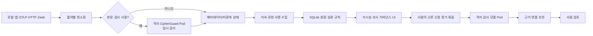

# EvidScope 1차 기술 가이드

작성일: 2026-09-12 · 대상: 개발자, 보안 운영자, AI 감사 담당자

## 무엇을 구현했나

EvidScope는 연결된 로컬 실행기·애플리케이션·네트워크 관측 지점에서 AI 사용 메타데이터를 모으고, 서명된 증적과 조사 신호로 연결한다. 원문 prompt와 response는 중앙에 저장하지 않는다. 운영자가 명시적으로 켠 수집 지점에서는 원문을 그 지점의 메모리에서만 CipherGuard로 검사하고, 중앙에는 검사 상태·범주·모델 버전·관측 범위만 보낸다.

중앙 수집 스키마는 [AI 관측 어댑터](../src/ai-observations.mjs)와 [이벤트 허용 목록](../src/model.mjs)에 고정돼 있다. `prompt`, `response`, HTTP body, Authorization, cookie, URL query, 임의 OTLP attribute는 통과하지 않는다. 내용이 보이지 않는 TLS/Zeek 관측은 `metadata` 또는 `unobserved`로 남고 언어·유출 여부를 추정하지 않는다.

## 주요 구성요소

| 구성요소 | 책임 | 중요한 경계 |
|---|---|---|
| `ai-observations.mjs` | SDK, local, HTTP, OTLP, Zeek 입력을 v2 메타데이터로 정규화 | 임의 필드와 원문 제거, 상관 신뢰도 명시 |
| `content-screening.mjs` | 허용된 4개 본문 필드를 일시 검사하고 문자 체계·검사 상태 산출 | 원문 반환·저장 없음, 실패를 안전으로 취급하지 않음 |
| `durable-observer.mjs` | 디스크 큐, 유한 재시도, ACK·실패 기록 | 자격·원문 오류를 spool에 저장하지 않음 |
| `ai-visibility.mjs` | 자산·관측 범위·언어 신호·8개 조사 시나리오 집계 | 경보는 후보 신호이며 침해·유출·위반 확정이 아님 |
| `governance-policy.mjs` | KR/EU/NIST/ISO 적용성 검토 후보와 부족한 사실 산출 | 자동 준수·법률 판정 없음 |
| `assistance.mjs` | 사람이 선택한 증거와 최대 3개 요구사항을 서명 묶음으로 동결 | 원문·사건 제목·비밀·임의 도구 제외 |
| `isolated-inference-client.mjs` | 고정 내부 DNS와 mTLS로 한 번의 JSON 초안 요청 | 임의 URL·호스트 모델·도구 호출·리디렉션 없음 |
| `model-runtime.mjs` | Pod 생성부터 UID 기반 종료 확인까지 수명주기 관리 | 삭제 요청만으로 종료 성공 처리하지 않음 |
| `training-resource-guard.mjs` | 유휴 PC에서만 학습을 허용하고 사용자 입력 재개 시 중단 | 호스트 영수증 없거나 오래되면 시작 금지 |

## 모델 구성과 선정 이유

현재 코드의 기준 모델은 `fdtn-ai/Foundation-Sec-1.1-8B-Instruct`다. 보안 사건·CTI와 직접 관련된 공개 가중치이고 공식 Q4 배포가 있어 RTX 3080 12GB에서 제한된 비교를 시작하기 적합하다는 이유다. 실제 한국어 감사 성능이나 이 PC에서의 속도는 아직 측정하지 않았다.

2026-09-19 사용자 요청으로 `Foundation-Sec-8B-Reasoning`을 학습 후보로 선택했다. 제작자 보고 CTI-MCQA와 RCM은 높지만 지시 이행 점수가 일부 낮아졌고, 512 출력 토큰에서 reasoning 출력이 잘릴 수 있다. 추론 서비스의 기존 기준 모델은 후보의 동일 조건 평가가 끝난 뒤 별도로 교체한다. 선택한 원본 가중치 revision과 파일 해시는 [학습 모델 명세](../deploy/training/selected-model.json)에 고정했다. [상세 재검토](security-model-reassessment-20260912.md)

`CipherGuard V5`는 XLM-R 기반 민감정보 범주 분류 보조다. 한국어·영어 본문 검사에 쓰지만 사건 추론, 번역, 증거 연결, 모든 민감정보 위치 검출, 자동 마스킹을 맡기지 않는다. 512 토큰 중첩 분할, 최대 8조각, 10초를 넘으면 `partial` 또는 `timeout`으로 남긴다.

## 다국어 처리

이벤트 키·상태·CVE·주소·식별자는 영어 형식을 유지한다. 사용자 설명·목적·정책·질문에는 한국어와 혼합 문자열이 들어올 수 있다. 문자 집계는 한글/라틴/혼합/기타/판별 불가를 세며, 라틴 문자가 있다는 이유로 영어 이해 성공으로 해석하지 않는다.

후보 평가 자료는 감사 사건 180가족을 영어·한국어·혼합으로 묶어 학습 300, 검증 60, 시험 180행으로 만들었다. CipherGuard 후보는 60가족의 180행이다. 모두 합성·미검토이며 성능 점수가 아니다. 번역본은 같은 분할에 고정된다. [데이터 안내](../data/multilingual-evals/README.md)

## 격리 추론

[추론 배포 템플릿](../deploy/model-runtime/render.mjs)은 모델별 독립 Job과 Service를 만든다. 기본은 `suspend: true`이며 이미지가 `UNPINNED-BLOCKED`라 실행할 수 없다. 활성화하려면 가중치 revision·SHA-256·라이선스 검토, digest 고정 이미지, mTLS secret, 실제 CNI deny-all·교차 namespace·파일 미접근·프로세스 종료 측정 영수증이 모두 필요하다.

Pod는 비루트, 읽기 전용 root filesystem, 권한 상승 금지, capability 제거, service-account token 미탑재, host network/PID/IPC 미사용, egress deny-all을 적용한다. 업무 디렉터리와 로그 DB를 마운트하지 않고 승인된 가중치 PVC만 읽기 전용으로 본다. 모델 컨테이너는 파일·셸·브라우저·MCP 도구를 받지 않는다.

Foundation-Sec는 CPU 2개·RAM 8GiB·context 2,048·output 512·동시 1건·요청 120초다. CipherGuard는 CPU 1개·RAM 4GiB·동시 1건·10초다. GPU 수량 요청은 VRAM 상한을 보장하지 않으므로 실제 사용량은 별도 측정해야 한다.

실행 CLI는 `--execute-isolated-model`, TLS 설정, artifact lock, 5분 이내의 격리 측정 영수증과 공유 Lease 설정이 모두 없으면 시작하지 않는다. 정상·실패·취소·timeout 뒤에는 UID를 묶어 삭제하고 Pod 부재 또는 모든 컨테이너 종료를 확인한다. 확인하지 못하면 `MODEL_STOP_UNCONFIRMED`로 실패한다.

## 다른 PC 작업을 방해하지 않는 학습 정책

같은 소비자 GPU에서 학습과 화면 앱을 동시에 돌리면서 영향이 전혀 없다고 보장할 수는 없다. 영향 0이 필수인 환경은 전용 PC 또는 전용 GPU에서만 학습한다. 이 PC에서는 다음 보수적 조건으로만 실행 후보가 된다.

- Windows 입력이 15분 이상 없고 CPU 20% 이하, 여유 RAM 18GiB 이상, GPU 사용 1GiB 이하·사용률 10% 이하이며 다른 Python/Ollama 계열 연산이 없을 것
- 전원 연결 상태이며 GPU 온도 80°C 이하일 것
- 학습 중 키보드·마우스 입력이 생기거나 여유 RAM이 8GiB 아래로 내려가면 다음 호스트 점검에서 종료 요청. 설정된 대기 간격은 2초지만 probe·Kubernetes 요청·Pod 종료 시간이 추가되므로 2초 안의 종료를 보장하지 않는다.
- CPU 2개·RAM 12GiB·낮은 Kubernetes PriorityClass·preemption 금지·GPU 메모리 분율 최대 0.65·한 Job 1시간 상한
- 학습과 추론은 동일 공유 Lease로 동시 실행하지 않고, 종료 후 Pod 부재가 확인되기 전 다음 작업을 시작하지 않을 것

호스트 점검은 `npm run training:host-check`로 볼 수 있다. 이 명령은 모델이나 Pod를 시작하지 않는다. 현재 점검이 불가능하거나 하나라도 기준을 넘으면 종료코드 2와 차단 이유를 반환한다.

## 학습과 승격

학습 자료는 사람이 원본·동의·개인정보·정답을 검토한 학습 300, 검증 50, 시험 100건 이상이어야 한다. 자동 생성 후보를 자동으로 `HUMAN_REVIEWED`로 바꾸지 않는다. `approvedOutput`, reviewer, 시간, 원본 hash와 검토 후 payload hash가 맞아야 한다.

[QLoRA 학습기](../scripts/train-foundation-lora.py)는 오프라인 Pod와 고정 base artifact를 요구한다. rank 8, sequence 1,024, batch 1, gradient accumulation 16으로 시작하고 test 분할을 Trainer에 넘기지 않는다. 출력은 adapter와 실행 영수증뿐이며 자동 배포하지 않는다.

후보와 기준 모델은 같은 시험 자료·자원 조건에서 쌍으로 실행한다. 필수 보안 검사 통과, 영문 성능 저하 2%p 이하, 목표 과제 5%p 이상 개선 조건과 독립 사람 검토를 모두 만족해야 승격 레지스트리 후보가 된다. 승격 도구도 배포를 직접 바꾸지 않으며 이전 artifact rollback pointer를 보존한다.

## 현재 확인 상태

- 구현·합성/무모델 시험: 완료
- 실제 가중치 다운로드·모델 추론·Pod 실행·학습: 미실시
- reviewed 학습 자료: 0/0/0, admission 차단
- 이미지·CipherGuard revision·CNI/mTLS·GPU 실측: 미확인, activation 차단
- 모델 선택: 2026-09-19 Reasoning 학습 후보 선택 완료. 기존 추론 프로필은 후보 학습·평가 전까지 유지.

이 구분은 UI의 `AI 검토실 → 모델·학습 상태`에서도 그대로 표시한다. `기본 OFF`와 `실제 종료 확인`, `설정상 격리`와 `실측 격리`를 같은 상태로 표시하지 않는다.
