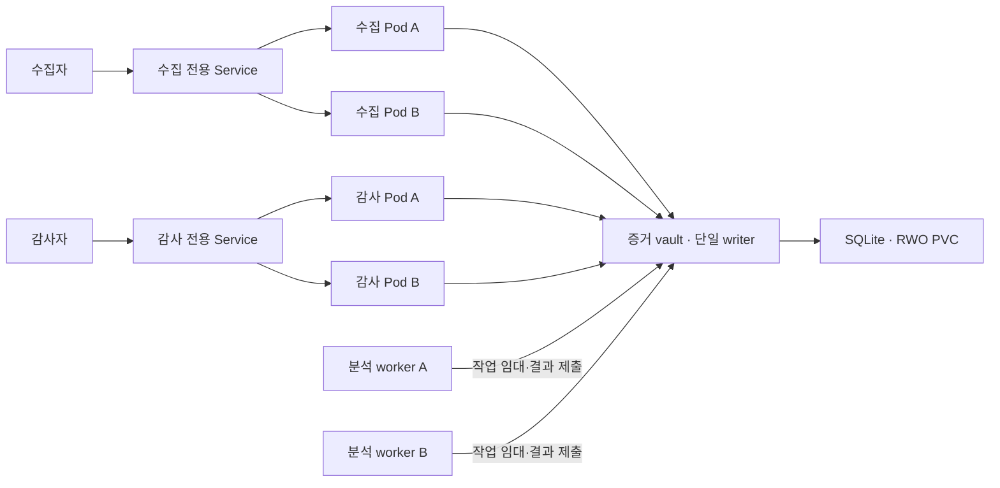

# Kubernetes 로드밸런싱과 고가용성 검증

2026-09-08 전용 Kubernetes 클러스터에서 Service 분산, HPA2→3→2, 수집 Pod 교체, vault Pod 재생성 후 증거 보존을 실제 확인했다. 초기 연결·장애 중 요청·부하 timeout 실패도 함께 기록했다. [실행 결과와 한계](../reports/kubernetes-runtime-20260908.md)를 따른다. SQLite 증거 vault는 단일 writer/PVC이므로 제품 전체의 고가용성 완료가 아니다.



## 적용한 구성

- 수집·감사 Service는 ClusterIP, sessionAffinity=None, internalTrafficPolicy=Cluster다. 서로 다른 API의 인증·네트워크 경계를 유지하며 준비되지 않은 endpoint를 서비스 대상으로 공개하지 않는다.
- stateless Deployment는 최소2개로 시작하고 HPA는 CPU 기준2~6개를 목표로 한다. HPA는 트래픽 분배기가 아니라 복제 수를 조정하는 별도 제어기다. metrics-server와 실제 CPU 수요가 없으면 확장 여부를 확인할 수 없다.
- hostname별 topology spread의 minDomains=2와 DoNotSchedule을 사용한다. 최소2개의 스케줄 가능한 노드가 필요하며 단일 노드에 두 복제본을 몰아 배치하지 않는다. 이 필드 사용을 위해 Kubernetes1.30 이상을 요구한다. 한 PC의 컨테이너 노드2개는 실제 물리 장애영역2개와 같지 않다.
- stateless rolling update는 maxUnavailable=0/maxSurge=1, startup probe와 최소 Ready3초를 설정했다. PDB는 자발적 eviction을 제한하며 직접 삭제·정전·단일 저장소 장애를 해결하지 않는다.
- `/healthz`는 프로세스 생존 상태, `/readyz`는 처리 준비 상태다. API gateway는 인증서 검증을 유지한 vault 연결을 확인하고 실패하면503을 반환한다. 준비 검사에는1.5초 한도,500ms 캐시, 동시 검사 합치기를 적용했다. worker는 최근 처리 루프 성공 여부를 확인한다. 이 검사는 디스크 정전 내구성이나 모든 쓰기의 성공을 보증하지 않는다.

근거: [Service와 외부 LoadBalancer 구현 조건](https://kubernetes.io/docs/concepts/services-networking/service/), [준비되지 않은 Pod의 서비스 제외](https://kubernetes.io/docs/tasks/configure-pod-container/configure-liveness-readiness-probes/), [Topology spread](https://kubernetes.io/docs/concepts/scheduling-eviction/topology-spread-constraints/), [HPA](https://kubernetes.io/docs/concepts/workloads/autoscaling/horizontal-pod-autoscale/). 확인일2026-09-08.

## 실제 분산 증명

`deploy/distribution-jobs.json`은 수집·감사 경로를 별도 자격으로 시험한다. `scripts/k8s-distribution.mjs`는 요청마다 새 TCP 연결을 열어 동일 Service 주소로60개 요청을 보낸다. keep-alive 한 연결이 한 Pod에 붙는 것을 요청 분배 실패로 오해하지 않는다. 서버의 `POD_NAME` Downward API 값이 안전하게 정제된 `x-evidscope-instance`로 반환된다. 요청이나 upstream에서 보낸 동명 헤더로 gateway 식별자를 바꿀 수 없다.

정상 단계의 사전 통과 기준:

1. 두 API 각각 실제 Ready Pod2개 이상, 서로 다른 노드2개 이상, Service의 Ready EndpointSlice와 Pod 이름/UID/IP 일치.
2. Service 경유60개 요청 모두 정상 응답, instance 누락0, 서로 다른 처리 Pod2개 이상. 정확한50:50 비율은 요구하지 않는다.
3. 수집202 응답의 source/id 집합이 독립 증적 export에 모두 포함되고 서명 검증 성공. timeout은 접수 성공으로 간주하지 않고 불명확한 결과로 보관한다.
4. replica 종료·readiness 실패 후 endpoint 제외와 남은 Pod의 처리를 관측한다. 진행 중 요청 실패도 숨기지 않고 유한 재시도 후 원본 ID로 중복/누락을 대조한다.
5. HPA가 실제2→3 이상으로 바뀐 시각·metrics·Ready endpoint를 함께 기록하고, 새 Pod에서도 요청을 처리했는지 확인한다. 처음부터 replica3인 상태는 자동 확장의 증거가 아니다.

소유권이 확인된 전용 실험 cluster에서만 아래 명령을 실행한다. `$labContext`는 현재 context에서 암묵적으로 가져오지 않는다. 먼저 [운영 절차](operations.md)에 따라 TLS와 최소권한 client Secret, core workload를 준비한다.

```powershell
kubectl --context $labContext apply --dry-run=server -f deploy/kubernetes.json
kubectl --context $labContext apply --dry-run=server -f deploy/distribution-jobs.json
kubectl --context $labContext apply -f deploy/distribution-jobs.json
kubectl --context $labContext -n evidscope wait --for=condition=complete job/distribution-collector job/distribution-auditor --timeout=180s
kubectl --context $labContext -n evidscope logs job/distribution-collector
kubectl --context $labContext -n evidscope logs job/distribution-auditor
node scripts/k8s-inspect.mjs --context $labContext --out deploy/reports/cluster-before.json
```

Job은 자동 재시도하지 않는다. 실패 Pod의 종료 상태와 로그를 보관한다. Pod별 헤더는 진단 메타데이터이며 서명된 외부 사실이 아니므로 실제 cluster의 EndpointSlice·Pod·노드 상태와 대조한다. `kubectl port-forward service/...`는 한 Pod로 연결될 수 있으므로 로드밸런싱 통과 증거로 사용하지 않는다.

## 외부 접속과 저장소의 남은 단계

현재 Service는 클러스터 내부용이다. 외부에서 접속하려면 배포 환경에 맞는 사설 LoadBalancer 또는 Gateway controller, DNS/TLS, 허용된 collector/auditor 네트워크 경로를 추가해야 한다. `type: LoadBalancer` 한 줄만 바꾼다고 외부 로드밸런서가 생기거나 현재 NetworkPolicy를 통과하지 않는다. 제공자를 모르는 상태에서 공용 주소나 전체 IP 허용 규칙을 임의로 만들지 않았다.

전체 고가용성이 목표라면 단일 vault를 그대로 복제해서는 안 된다. 여러 writer에서 테넌트별 원장 순번과 head 갱신·중복 방지를 하나의 트랜잭션으로 처리하고, 장애 전환 시 이전 writer의 쓰기를 막으며, 서명 권한을 분리하는 저장 구조가 필요하다. HA 데이터베이스와 별도 키관리로 전환한 뒤 DB/노드/네트워크 장애 시험에서 성공 접수 무손실과 체인 일관성을 검증해야 한다. 현재 SQLite 파일을 여러 Pod가 공유하도록 replicas만 늘리는 변경은 적용하지 않았다.
