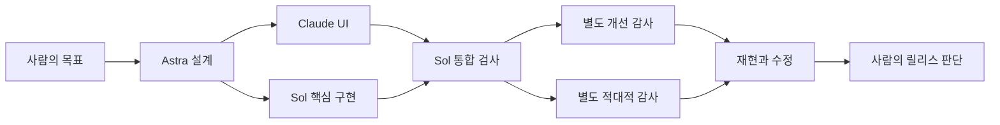
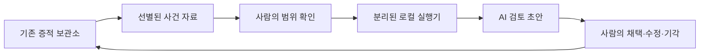

# 다중 에이전트 개발과 감사 지원

설계 기준: 2026-09-09. 이 문서는 역할 분담과 검증 기준이다. 실제 통과·실패·미실행 상태는 구현 검증 보고서에서 확인한다.

## 두 종류의 팀

개발팀은 EvidScope의 코드와 검증 자료를 만든다. 운영 지원팀은 사람이 선택한 사건의 제한된 자료로 검토 초안을 만든다. 개발 도구 구독을 운영 서비스의 무제한 API로 사용하지 않는다.

| 역할 | 기본 모델 | 담당 결과 |
|---|---|---|
| 설계와 발전 방향 | GPT-6 Astra / high | 설계 결정, 완료 조건, 우선순위 |
| UI와 사용성 | Claude Sonnet 5 | 화면, 그래프, 접근성, 오류·빈 상태 |
| 핵심 구현과 통합 | GPT-5.6 Sol / medium, 보안 변경 high | 수집·API·저장·권한·테스트·배포 |
| 개선 감사 | GPT-6 Astra / high, 별도 문맥 | 재현 가능한 결함과 검증 공백 |
| 적대적 감사 | GPT-6 Astra / high, 별도 문맥 | 악성 자료·거짓 승인·권한 혼동 사례와 재현 시험 |
| 법규 명세 | GPT-5.6 Sol / high | 공식 원문 연결, 적용 조건, 인간 검토 질문 |
| 자료 정리 | GPT-5.6 Luna / low | 색인·변경·시험 결과 요약 |

각 배치는 초기 가설이다. 토큰 단가가 실제 작업의 비용·품질 우위를 입증하지 않는다. 요구한 모델을 사용할 수 없으면 미실행으로 기록하고 다른 모델로 조용히 대체하지 않는다.

사용자 추가 지시에 따라 1차 적대적 감사에는 고급 모델을 우선 배치한다. Claude의 별도 적대적 검토는 후속 교차 검토로 남긴다. Claude UI 작업은 실제 Sonnet 5 구독 세션에서 수행했으며, 2026-09-09 사용 한도에 도달한 뒤 추가 수정은 후순위로 전환했다. 한도 소진을 API 비용 지출로 해결하지 않는다.

## 작업 인수인계

작업마다 `taskId`, 기준 커밋, 담당 역할, 요구사항, 허용 파일, 완료 조건, 산출물 커밋, 시험 결과와 남은 문제를 기록한다. 제품 수정자는 별도 worktree에서 작업한다. UI/API 계약을 먼저 고정하고 변경을 합친다.

1. 설계자가 요구사항·API·실패 조건을 명세한다.
2. Claude가 UI, Sol이 서버·실행기를 구현한다.
3. Sol이 통합 검사와 실제 HTTP 검증을 수행한다.
4. 별도 검토 문맥에서 요구사항·코드·시험 결과를 먼저 검토한다.
5. 지적을 재현하고 수정한다. 동일 문제의 수정·검토는 최대 두 회차다.
6. 해결되지 않은 문제는 설계 재검토와 인간 판단으로 넘긴다.

개발 실행 상한은 도구 전체 합계 3개다. 하위 위임은 한 단계로 제한한다. 작업 실행기를 우회해 사용자가 별도로 시작한 세션까지 통제했다고 주장하지 않는다. 감사자는 제품 코드를 수정하거나 자신의 지적을 스스로 종결하지 않는다. 모델이 다르다는 사실만으로 감사 독립성이 보장되지는 않는다.

Codex와 Claude의 전문 에이전트는 서로 다른 실행 기능이다. 작업 명세와 Git 변경을 교환한다. 실험적인 Claude Agent Teams를 필수 기반으로 두지 않는다. [Codex 전문 에이전트](https://learn.chatgpt.com/docs/agent-configuration/subagents), [Claude 병렬 작업](https://code.claude.com/docs/en/agents)

## 운영 지원팀과 보관소의 경계

| 운영 역할 | 입력 | 검토 초안 |
|---|---|---|
| evidence-organizer | 허용된 사건 기록 | 출처·버전·행동 목록, 누락 |
| evidence-reconciler | AI 보고·도구·권한 기록 | 일치·불일치·미확인과 인용 |
| governance-assistant | 승인된 규정 자료와 시스템 사실 | 적용성 질문·근거 부족·보완 과제 |
| report-drafter | 제한된 증거와 검토 자료 | 사실·불확실성·후속 조치 요약 |

사람이 사건과 자료를 선택하고 최소화된 내용을 확인한 뒤 분석 작업을 요청한다. 실행기는 해당 작업의 자료와 자격만 사용한다. 원본 DB·서명키·감사자 토큰·실제 업무 도구를 모델에 제공하지 않는다. AI 의견은 기존 규칙 평가와 인간 판단을 대체하지 않는다.

로컬 모델은 Qwen3 4B를 후보로 사용한다. 기존 Qwen3 0.6B의 연결 시험 성공을 4B의 감사 품질 검증으로 표현하지 않는다. 실행은 동시 1개, 모델 응답 최대 4회, 최대 5분으로 제한한다. 실패·시간 초과·근거 부족은 별도 상태로 남긴다. 외부 유료 모델 전환과 자동 반복 위임을 하지 않는다.

같은 PC의 프로세스 분리는 호스트 관리자 침해에 대한 독립성을 보장하지 않는다. 서명은 기록 무결성을 지원하며 모델 출력의 사실성을 인증하지 않는다. 참고자료 인용은 내부 사고 과정이나 인과적 사용을 입증하지 않는다.

## 역할 조정과 가중치 학습

역할 패키지는 목적·금지 범위, 허용 도구, 지식 자료 버전, 정상·반례, 출력 계약, 평가 세트, 모델·어댑터 버전을 묶는다. 지침 변경, 검색 변경, 도구 변경, 실제 가중치 학습을 각각 기록한다.

초기 역할별 사례 목표는 60개(조정 30/검증 10/최종 시험 20)다. 생성된 합성 사례와 사람이 검수한 정답을 구분한다. 사건의 유사 변형이 서로 다른 분할에 들어가면 평가에서 제외한다. AI가 만든 라벨을 인간 검수로 표시하지 않는다.

LoRA의 첫 후보는 증거 정리 역할이다. 사람 검수 학습 300개·검증 50개·별도 시험 100개가 확보되고, 지침·검색·실행기 개선 후에도 반복 오류가 남는 경우에만 학습한다. 이 조건을 충족하지 않으면 학습을 실행하지 않는다.

보유 장비는 검사 시 RTX 3080 12GB와 RAM 32GB였다. 메모리 시험 후 4비트 PEFT LoRA의 rank 8, 입력 길이 2,048, 배치 1을 시작값으로 사용한다. 주요 오류가 같은 평가 조건에서 상대 20% 이상 감소하고 필수 안전 시험이 악화되지 않아야 후보를 채택한다. 후보·병행 평가·인간 승인·적용·이전 버전 복귀를 구분한다. [Qwen 모델 카드](https://huggingface.co/Qwen/Qwen3-4B), [PEFT 양자화 학습](https://huggingface.co/docs/peft/main/en/developer_guides/quantization)

GPT-5.6 Sol은 확인한 공식 API 문서에서 파인튜닝 미지원이다. 상용 개발 모델에는 역할 패키지를 적용하며, 실제 가중치 학습은 지원하는 로컬 공개 가중치 모델에서 수행한다. [Sol 지원 기능](https://developers.openai.com/api/docs/models/gpt-5.6-sol)

## 법규와 인간 검토

공식 원문 → 적용 조건 → 통제 → 증거 → 인간 검토 → 보완 과제를 연결한다. 법률·시행령·고시·가이드라인·내부 정책의 지위와 시행일·확인일·검토자를 구별한다. 개정은 재검토 신호이며 과거 인간 판단을 자동으로 바꾸지 않는다.

제31조의 고지·표시, 제33조의 고영향 사전 검토, 제34조의 위험관리·설명·이용자 보호·인간 감독·문서화를 중심으로 기존 매핑을 사용한다. 적용 조건과 예외·기관 확인·최종 준수 주장은 지정된 인간 검토자가 판단한다. 법적 지원 범위와 원문은 [법적 출처](legal-sources.md)를 따른다.

## 시험과 비용

필수 시험은 tenant/사건/작업 자격 격리, 인간 승인 사칭, 잘못된 인용, 증거 변경, 수집 장애, 모델 오류, 악성 문서 명령, 개인정보·비밀 노출, 접근성, 구독 한도와 실행 상한이다. 감사 에이전트의 동의는 시험 결과가 아니다.

추가 API 예산은 0원이다. 기존 구독 한도 소진은 대기로 처리하며, 크레딧 구매·유료 API 대체·GPU 임대를 기본 동작으로 넣지 않는다. 로컬 전력·시간·유지보수와 사람의 검수 비용은 별도다. 사용량이 없거나 불명확한 실행을 비용 0으로 표시하지 않는다. 구독 실행에서 보고되는 API 환산 추정액은 실제 추가 청구액과 구분한다.

완료 상태는 기능 구현, 합성 시험, 실제 공급자 실행, 실제 모델 평가, 실제 Kubernetes 검증, 인간 검수, 운영 승인으로 나누어 보고한다.
