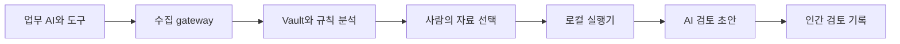

# EvidScope 프로젝트 포트폴리오

기준 시점: 2026-09-09 19:00 KST · 검증 기준 커밋 `300c07f` · 1차 초본

## EvidScope 프로젝트 포트폴리오

AI 행동과 참고자료를 연결하는 감사 지원 서비스

업무 AI의 자기보고, 도구 결과, 권한과 참고자료를 대조하고 사람이 검토 근거를 남기는 로컬 파일럿이다. 보안·플랫폼 개발 관점에서 관측 가능한 사실, AI 검토 의견, 인간 판단의 경계를 설계했다.

| 프로젝트 성격 | 주요 기술 | 현재 단계 |
| --- | --- | --- |
| 사용자 주도 AI 협업 개발 | Node.js 24 · SQLite · 정적 JavaScript UI | 실행 가능한 1차 파일럿 |
| 행동 가시성과 감사 지원 | 서명 원장 · Docker · Kubernetes · Ollama | 실제 로컬 추론 확인 · 보안 보완 중 |

공개 운영·고객 도입·법률 인증·학습 완료를 주장하지 않는다. 실제 실험의 실패와 미확인 사항도 결과에 포함한다.

---

## 수치를 근거까지 따라갈 수 있는 화면

실제 에이전트 목록. 합성·로컬 시험 기록이며, 미확인은 산정 불가로 표시한다. 화면에 표시된 비율은 관측된 행동의 정책 평가이며 법적 준수율이 아니다.

설계 선택은 분모를 드러내는 것이다. 준수율 옆에 평가 범위를 표시하고, 각 행동의 자료·권한·결과로 이동하게 했다. 주식형 시간축은 확대·이동·최신 따라가기를 제공하며, 상세 조사와 주간 검토의 집계 간격을 구분한다.

---

## 실험으로 확인한 결과와 개선 사례

| 관점 | 실제로 확인한 결과 | 해석의 범위 |
| --- | --- | --- |
| 로컬 AI 지원 | Qwen3 4B 실제 실행 10.90초 / 46.04초 | 서로 다른 합성 입력 2회, 평균 성능 아님 |
| 품질 문제 발견 | 참고자료 충돌·수집 공백 주장 일부의 인용 불충분 | 초안 시험상 반려, 실무 품질 승인 보류 |
| 내부 Service 분산 | 수집 60/60, 감사 60/60 · 각 2개 Pod | 9월 8일 이전 구현, 외부 LB 시험 아님 |
| HPA와 복구 | replica 2 → 3 → 2, 성공접수 515건 보존 | 8 timeout 발생, 단일 PVC의 Pod 복구 |
| 적대적 감사 | 기존 지원 시험 8개 통과 후 추가 결함 5개 재현 | 조건부 P1 1개, P2 4개 · 수정 재검증 중 |

### 인용 ID 검증만으로 충분하지 않았던 사례

로컬 모델은 존재하는 기록을 인용했지만, 그 기록이 해당 주장을 지지하지 않는 경우가 있었다. 이 결과를 성공으로 포장하지 않고 반려 기록과 원본 초안을 함께 보존했다. 다음 조치는 선택 근거와 사건 전체 규칙 평가를 분리하고, 역할 평가에 인용 타당성과 근거 부족 감지를 추가하는 것이다.

두 AI 검토 기록은 자동화가 합성 인간 역할 자격으로 API·화면 경계를 검증한 결과다. 실제 사람의 내용 검수나 채택률 자료가 아니다. 성능·정확도 향상과 업무 시간 절감률은 아직 측정하지 않았다.

근거: reports/assistance-local-20260909.json · reports/assistance-ui-local-20260909.json · reports/astra-adversarial-20260909.md · reports/kubernetes-runtime-20260908.md

---

## 역할 분담과 포트폴리오 소개 문안

사용자는 사람이 판단할 수 있는 가시성을 우선 목표로 정하고, 로컬 모델 실증·Kubernetes 분산·역할별 에이전트·추가 API 비용 0원이라는 조건을 결정했다. 설계와 감사에는 Astra, 핵심 구현에는 Sol, UI에는 Claude를 배치한 AI 협업 프로젝트다. 아래와 같이 기획·판단과 구현 기여를 구분한다.

| 구분 | 산출물과 책임 |
| --- | --- |
| 사용자 | 문제 정의, 우선순위·모델·비용 조건 결정, 최종 검토와 공개 판단 |
| Astra | 아키텍처·개선 방향·독립 적대적 감사와 문서 정리 |
| Sol | 수집·API·저장·로컬 실행기·검증 및 통합 구현 |
| Claude | 팀·AI 지원 UI 초안 구현. 추가 UI 수정은 구독 한도로 보류 |

### 소개 글에 사용할 수 있는 문안

EvidScope는 AI 행동·도구 결과·권한·참고자료를 연결하는 감사 지원 파일럿입니다. 근거가 부족한 상태를 준수로 계산하지 않고, 실제 로컬 모델이 작성한 초안을 별도 검토 기록으로 관리하도록 구성했습니다. AI 협업 개발에서 설계·구현·UI·적대적 감사를 분리했으며, Kubernetes 분산·복구와 로컬 추론 시험에서 확인한 성과와 실패를 원자료로 남겼습니다.

### 다음 단계

보안 결함 수정과 재감사 → 개발 실행 이벤트와 역할 패키지 통합 → 인용 품질 평가 → UI 보완 → 최신 Kubernetes 및 격리 재검증 순으로 진행한다. 선택적 LoRA는 사람 검수 데이터와 평가 기준을 충족한 이후에 검토한다.

저장소 공개 주소와 실서비스 주소는 미확정이다. GitHub 업로드 완료나 고객 운영 실적으로 표기하지 않는다. 상세 구현 보고서는 함께 제공하는 EvidScope 1차 개발 보고서를 참조한다.

운영 원칙 추가: 테스트 외에는 모델·시험 워커를 중지한다. 19시 14분에 전용 모델·클러스터·로컬 시험 서버의 중지를 확인했으며, 자동 정리 도구는 구현 중이다.
