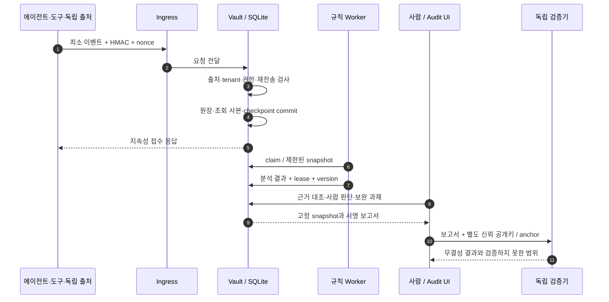
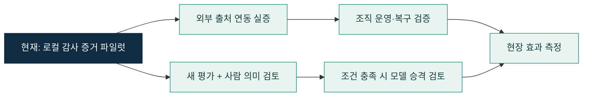

# EvidScope · 제품과 구현 이야기

> **AI가 무엇을 했는지, 어떤 권한과 근거로 했는지, 실제 결과가 무엇인지 확인하는 감사 증거·거버넌스 포트폴리오.**

2026-10-06 기준 · 현재 개발 소스 **v0.1.2** · 검증된 이전 로컬 설치본 **v0.1.1**

[제품 홈](../README.md) · [구현 아키텍처](architecture.md) · [검증 현황](verification-status.md) · [전체 문서](README.md)

## 1. 어떤 포트폴리오인가

EvidScope는 AI 거버넌스와 보안 엔지니어링을 결합한 **실행 가능한 로컬 파일럿**이다. 수집 API, 인증과 권한, 암호화 저장, 서명 원장, 규칙 분석, 감사 화면, 문서 복구, 테스트와 배포 도구까지 구현했다. 금융 AI를 예시 업무로 사용하지만 실제 금융기관에 납품하거나 운영한 제품은 아니다.

핵심 질문은 단순한 “AI를 사용했는가?”에서 한 단계 더 들어간다.

- 에이전트가 했다고 말한 행동과 도구의 실제 기록이 같은가?
- 행동 당시의 권한, 승인, 모델, 정책과 참고 문서 버전을 확인할 수 있는가?
- 기록이 없거나 서로 충돌할 때 그 사실을 그대로 보여 주는가?
- 사람이 검토한 이유와 이후 변경 이력을 나중에도 확인할 수 있는가?
- 내보낸 보고서를 제품 밖에서 별도의 신뢰 기준으로 검증할 수 있는가?

이 프로젝트의 중심 역량은 **신뢰 경계 설계, 증거 무결성, 데이터 계보, 권한 분리, 실패 상태를 보존하는 검증**이다. AI 초안이나 자동 점수가 사람의 감사 판단을 대신하지 않도록 설계했다.

## 2. 누구의 어떤 문제를 해결하는가

| 사용자 | 겪는 문제 | EvidScope가 제공하는 작업 |
|---|---|---|
| AI 서비스 운영자 | 에이전트·도구·정책 기록이 분산됨 | 행동별 기록 연결, 누락·상충·재검토 확인 |
| 보안 담당자 | 출처와 권한이 다른 기록을 같은 수준으로 취급 | 출처 인증, tenant 격리, 당시 정책·권한 대조 |
| 감사·거버넌스 담당자 | 문서 링크와 자기보고만으로 이행 근거를 판단 | 실파일·운영 기록·사람 평가를 연결한 검토와 과제 |
| 검증 담당자 | 화면의 결론을 제품 외부에서 재확인하기 어려움 | 서명 원장·고정 보고서와 독립 검증 CLI |

기존 SIEM, 추적 도구, 정책 엔진, 업무 API가 만든 기록을 감사 근거로 연결하는 방향이다. 이 제품 자체가 업무 도구를 중개하거나 AI 실행을 승인·차단하지는 않는다. 등록 자산 수, 수신 기록 수, 증거가 갖춰진 행동의 범위를 각각 표시하며 미관측 활동을 전체 가시성으로 계산하지 않는다.

## 3. 지원 기능

| 영역 | 구현한 기능 | 지원 범위 |
|---|---|---|
| 관측·수집 | 앱 SDK, HTTP, OTLP의 지원 속성, Zeek·로컬 관측 입력 | 허용한 메타데이터 중심. OTLP의 임의 속성이나 암호화 트래픽 본문 전체를 관측한다고 표시하지 않음 |
| AI 행동 가시성 | 행동·에이전트·출처별 조회, 추이, 필터, 근거 연결 그래프 | 실제 수신 범위와 미확인·증거 부족 상태 분리 |
| 정책·결과 대조 | 행동·도구 결과·권한·참조 버전·정책 비교 | 규칙 기반 분석, 작업 lease와 버전으로 오래된 결과 거부 |
| 한국 거버넌스 | 한국 요구사항 18개, 기술 검사 23종, 시스템 schema 4 | 전체 목록 31개 중 한국 항목. 적용성과 법률상 충분성은 사람 검토 |
| 공급사 근거 | 공급사 문서·manifest·제공 모델·목적·검토 출처 결합 | 위험·설명·보호 조치 3종의 대안 경로. 감독·문서 의무의 포괄 대체가 아님 |
| 문서·사건 | 최대 4MiB 원본 문서 암호화 보관·복구, 검토·보완 과제 | 손상·만료·모델/정책 변경 때 재검토, 근거 없는 종결 거부 |
| 인증·권한 | source 인증, OIDC, tenant/role 분리, 세션 회수 | 합성 IdP와 로컬 시험. 실제 조직 IdP 도입은 별도 검증 |
| 보고·복구 | 서명 보고서, 원장 export, 독립 검증, 암호화 백업·새 경로 복구 | 별도 공개키·checkpoint/hash 필요. 원격 DR·HA는 후속 |
| AI 검토 지원 | 격리 모델 실행, 제한된 근거 정리, 학습·평가 검증 도구 | 기본 OFF. 품질 승격과 운영 자동 판단은 승인하지 않음 |

한국 거버넌스 수치는 [현재 요구사항](../data/requirements.json)과 [기술 증거 검사](../src/kr-governance-evidence.mjs)의 구현 범위다. 법률의 모든 의무를 빠짐없이 구현했다는 뜻은 아니다. 세부 필드와 검토 경계는 [증거 계약](kr-governance-evidence.md), [공급사 근거 계약](kr-supplier-reliance.md), [법령 확인 범위](legal-sources.md)를 따른다.

## 4. 간략한 기술 스택

| 계층 | 기술 | 선택·사용 목적 |
|---|---|---|
| 서버 | Node.js 24.15.x, ESM, 내장 HTTP/TLS | 프로세스별 역할과 API 경계를 명시적으로 구성 |
| 저장 | `node:sqlite`, SQLite WAL, transaction/savepoint | 단일 writer의 일관된 접수·원장·조회 사본 갱신 |
| 무결성·기밀성 | `node:crypto`, HMAC, Ed25519, AES-256-GCM | 수집 출처 인증, 서명 검증, 이벤트·문서 암호화 |
| 인증 | `openid-client` 6.8.8, OIDC, 서버 소유 역할 바인딩 | 조직 인증을 연결하는 경로와 tenant/role 권한 분리 |
| 화면 | HTML, CSS, Vanilla JavaScript | 한국어 조사·거버넌스 화면과 근거 그래프 |
| 실행·검증 | Node test runner, Docker, Kubernetes 도구 | 실제 HTTP/파일/프로세스 검증과 격리 실행 |
| 선택적 모델 연구 | Python, PyTorch, PEFT, NF4 QLoRA | Foundation-Sec-8B-Reasoning 후보의 제한된 학습·평가 |

수집, 집계, 정책 대조, 서명에는 상시 LLM 호출이 필요하지 않다. 모델 경로는 제품의 필수 실행 조건이 아니며 가중치도 저장소에 포함하지 않는다.

## 5. 기능 구현 아키텍처

| 구성요소 | 핵심 책임 | 주요 구현 |
|---|---|---|
| Ingress | 수집 요청 크기·동시성 제한, Vault 전달 | [server.mjs](../src/server.mjs) |
| Vault | 최종 인증·권한, tenant, 지속성 접수, 암호화·서명 | [service.mjs](../src/service.mjs), [store.mjs](../src/store.mjs) |
| Worker | 배정된 snapshot을 분석하고 유효한 lease/version으로 완료 | [worker.mjs](../src/worker.mjs), [analysis.mjs](../src/analysis.mjs) |
| Audit UI/API | 행동·문서 조사, 사람 검토, 과제, 보고서 | [audit-workbench.mjs](../src/audit-workbench.mjs), [console.js](../public/console.js) |
| Integrity | 원장과 조회 사본·평가·영수증 대조 | [action-integrity.mjs](../src/action-integrity.mjs), [receipt-integrity.mjs](../src/receipt-integrity.mjs) |
| Governance | 적용 후보·조치·문서·사람 평가의 현재 버전 결합 | [governance-policy.mjs](../src/governance-policy.mjs), [kr-governance-evidence.mjs](../src/kr-governance-evidence.mjs) |
| Verifier / Recovery | 별도 신뢰 기준 검증, 암호화 백업·새 경로 복구 | [report-verifier.mjs](../src/report-verifier.mjs), [vault-recovery.mjs](../src/vault-recovery.mjs) |

### 하나의 행동이 감사 근거가 되는 과정

접수 성공은 분석 완료와 구분한다. 에이전트 출처는 독립 도구 출처를 사칭할 수 없고, worker는 사람의 결론을 변경할 권한이 없다. 감사자는 조회·조사를 수행하며 거버넌스 시스템·평가·과제 변경에는 검토자 또는 관리자 권한이 필요하다. 서명은 기록의 변경 여부를 확인하며 원천 주장이 참이라는 보증은 아니다.

## 6. 어떤 구현으로 어떤 문제를 해결했는가

### 전체 원장 검증의 비용을 줄이면서 변조 탐지를 유지

초기에는 반복 조회·수집마다 테넌트 전체 서명 원장을 재생해 병목이 발생했다. 트랜잭션의 checkpoint를 묶고 이미 검증한 head 이후의 서명 suffix와 조회 사본 delta를 대조하도록 바꿨다. 외부 writer, schema 변경, 직접 SQL 변경과 checkpoint 후퇴를 탐지하면 실패로 처리한다. 전체 export, 무결성 점검, 백업은 전체 체인 검증을 유지한다.

2026-10-05 로컬 합성 시험에서 **1,000/1,000건 접수·저장·분석, 최종 backlog 0**, 지속 구간 **600/600건·p95 206.81ms**를 기록했다. 이는 i7-12700F, RAM 32GiB, Windows, SQLite WAL, 1 writer·2 workers의 결과다. 이전 과부하 시험의 503 실패도 [개선 보고서](../reports/enterprise-incremental-integrity-performance-20261005.md)에 남겼다. 운영 SLA나 분산 저장소 성능으로 확대하지 않는다.

### 문서가 있다는 사실과 검토 가능한 증거를 구분

URL이나 문서명만 저장하면 실제 파일 손상, 모델 변경, 오래된 정책을 놓칠 수 있다. 원본 파일을 암호화해 보관하고 hash·복구 가능성·모델·목적·법령·정책 버전을 함께 대조했다. 부족한 기술 근거는 사람이 `sufficient`를 입력해도 자동으로 충족되지 않으며, 모델이나 문서가 바뀌면 재검토가 필요하다. [문서 API 설명](kr-governance-evidence.md)과 [구현](../src/governance-documents.mjs)에서 세부 계약을 확인할 수 있다. 일반 문서의 4MiB 상한과 공급사 묶음의 별도 상한은 구분한다.

### 감사자의 읽기 권한이 판단 변경 권한으로 확장되는 결함 수정

실제 HTTP 검토에서 감사자가 거버넌스 시스템·평가·과제를 변경할 수 있는 결함을 발견했다. Vault의 공통 권한 경계에서 reviewer/admin을 요구하도록 보완하고 gateway 및 직접 Vault 요청 **30개 거부**, 서명 상태 불변, 재시작·tenant 격리를 검증했다. 상세 결과는 [v0.1.1 보안 패치](first-release-security-patch-20261006.md)에 있다.

### 학습 완료와 실제 품질 향상을 별도로 검증

공개 인간 주석 QA를 사용한 격리 학습에서 모델·입력·adapter·runtime 해시와 실제 optimizer 갱신, 산출물 회수, 작업 종료를 확인했다. 최신 후속 학습은 **추가 20회 갱신·adapter 계보 누적 80회**이며 optimizer 재개 step과 계보를 구분한다.

앞선 관측 64문항의 엄격 통과는 **16/64 → 25/64**로 늘었지만 답변 가능한 문항은 **12/32 → 9/32**로 나빠졌다. 이 혼합 결과 때문에 품질 승격을 차단하고 새로운 미관측 평가와 사람의 의미 검토를 다음 조건으로 남겼다. 이 수치를 최신 누적 80회 후보의 평가 결과로 옮겨 쓰지 않는다. [훈련 검증](../reports/public-qa-grounding-continuation-verification-20261006.json), [생성 회귀 분석](../reports/public-qa-grounding-continuation-analysis-20261006.md).

## 7. 결과를 어떻게 읽어야 하는가

| 증거 | 확인된 결과 | 해석 범위 |
|---|---|---|
| v0.1.1 설치본 | 전체 758/758, 반복 10×39, Linux 39/39 | 이전 동결 설치본의 실제 시험 |
| 최근 소스 전체 실행 기록 | 836/836, 실패 0 | 해당 실행 시점의 소스·환경. 현재 게시로 재실행한 결과가 아님 |
| v0.1.2 반복 검증 | 8회 통과 후 9회차 117/119, 전체 실패 | 10회 완료 아님. 이후 집중 2/2와 구분 |
| 합성 수집·분석 | 1,000/1,000, backlog 0 | 단일 로컬 성능 시험 |
| 모델 후속 학습 | 추가 20회, adapter 계보 80회 | 실제 학습·산출물 검증. 품질 승인 아님 |

원본 링크와 실패 맥락은 [검증 현황](verification-status.md)에 모았다. 고객의 검토 시간 절감, 상용 서비스 대비 우위, 실제 금융기관 운영 성과는 측정하지 않았으므로 결과로 제시하지 않는다.

## 8. 발전 방향과 완료 조건

| 다음 작업 | 완료로 판단할 근거 |
|---|---|
| 실제 SIEM·정책 엔진·공급사·업무 결과 연동 | 독립 출처의 실제 ID·정책 버전·결과를 연결한 재현 가능한 사례 |
| 조직 IdP와 운영 권한 검증 | 실제 조직에서 로그인·회수·tenant/role 경계 및 운영 절차 실증 |
| 원격 DMS/KMS/WORM·HA·복구 | 외부 신뢰 anchor, 장애 시험과 측정한 RPO/RTO, 복구 후 검증 |
| 한국어·도메인 모델 평가 | 미관측 세트, 인용·기권·정답·안전성의 사람 검토와 회귀 기준 충족 |
| 실무 효과 측정 | 같은 과제에서 근거 탐색 시간·누락 발견·연동 비용의 비교 측정 |

공개 저장소는 소스와 개발 근거를 공유한다. 운영 인증, 법률상 준수 인증, 배포 모델 품질 승인 또는 공개 서비스 운영을 뜻하지 않는다.
