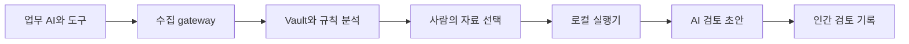
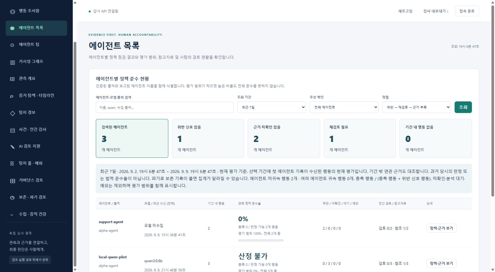
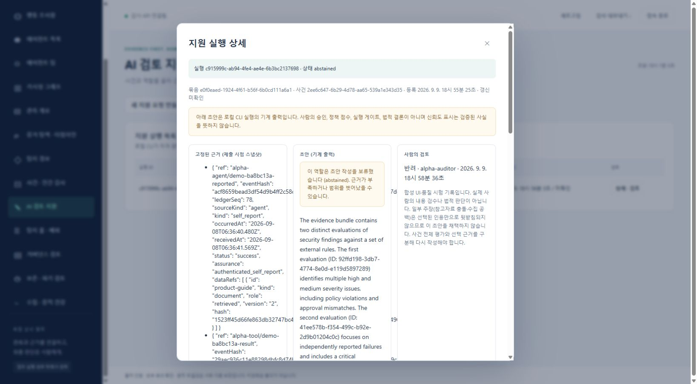

# EvidScope 1차 개발 보고서

기준 시점: 2026-09-09 19:00 KST · 검증 기준 커밋 `300c07f` · 1차 초본

## EvidScope 1차 개발 보고서

AI 행동과 참고자료를 근거로 사람이 검토하는 감사 지원 서비스

현재 결과물은 실행 가능한 로컬 파일럿이다. 에이전트별 행동·정책 평가와 사건 검토를 제공하며, 선택한 사건 자료를 실제 로컬 모델에 전달해 초안을 만들고 별도 검토 기록을 남기는 흐름을 확인했다. 운영 배포를 승인할 단계는 아니며, 독립 감사에서 재현한 결함과 모델의 인용 오류를 후속 작업으로 관리한다.

### 해결하려는 실무 문제

AI가 작업을 성공했다고 보고해도 도구 실행 결과, 당시 권한, 사용한 자료의 버전이 서로 다를 수 있다. EvidScope는 이 기록들을 한 행동으로 연결하고, 확인되지 않은 부분을 드러내어 보안 담당자와 감사자가 판단 근거를 남기도록 한다.

| 기능 묶음 | 1차 상태 | 현재 확인 범위 |
| --- | --- | --- |
| 행동과 참고자료 가시성 | 구현 | 출처별 기록 대조, 행동 연결도, 검색과 시간축 |
| 에이전트별 지표 | 구현 | 정책 준수율과 평가 범위, 미확인과 재검토 구분 |
| 사건과 거버넌스 | 구현 | 인간 검토, 규칙 버전, 근거 연결, 서명 보고서 |
| 로컬 AI 검토 지원 | 실제 추론 확인 | Qwen3 4B의 초안과 합성 검토 API 및 화면 흐름 |
| 다중 개발 에이전트 운영 | 통합 진행 | 역할 패키지, 실행 이벤트, 협업 상한과 인수인계 |
| 운영 승격 | 미완료 | 보안 수정 재검증, 모델 품질, SSO와 저장소 HA |

### 이 보고서의 기준

검증 기준은 300c07f와 2026년 9월 9일 19시까지 확보한 원자료다. 이후 진행 중인 보안 수정과 별도 작업 브랜치의 결과는 완료 성과로 포함하지 않는다. Kubernetes 수치는 9월 8일 이전 구현의 실험이며 최신 AI 지원 기능의 배포 결과와 구분한다.

사용자 역할은 목표·우선순위·비용·모델 배치 결정이며, 코드와 문서는 AI 협업으로 작성되었다. 개인의 직접 작성 비율, 고객 도입 실적, 업무 시간 절감률은 측정하지 않았다.

### 시험 외에는 실행 자원을 중지

후속 운영 지시를 반영해 19시 14분에 유휴 로컬 모델 컨테이너, 전용 Kubernetes 시험 클러스터와 로컬 시험 서버를 중지하고 관련 포트가 닫힌 것을 확인했다. 테스트를 명시적으로 시작할 때만 자원을 켜고 종료·실패 시 정리하는 도구는 추가 구현 중이다. 데이터와 볼륨은 보존했다.

---

## 시스템 구조와 판단의 경계

업무 실행의 관측 경로와 선택적 AI 검토 경로를 분리했다. 로컬 모델의 실패가 원본 증거의 수집·규칙 평가·인간 검토를 대체하거나 중단시키지 않도록 구성한다.

| 구성요소 | 책임 | 선택한 이유 |
| --- | --- | --- |
| Node API와 정적 UI | 수집·감사 gateway와 조사 화면 | 기존 구조 확장, 프레임워크 전환 비용 억제 |
| Vault와 SQLite | 증거·사건·서명 원장 소유 | 신뢰 영역 축소와 독립 내보내기 검증 |
| 규칙 worker | 관측 사실과 정책 대조 | 상시 추론 비용 없이 반복 평가 |
| 로컬 실행기와 Ollama | 선별 묶음으로 AI 초안 생성 | 원본 저장소 자격과 추론 권한 분리 |

### 기록 무결성과 내용의 진실성을 구별

서명은 기록이 바뀌었는지 확인하는 수단이다. 서명된 자기보고가 사실인지, 인용한 자료가 주장을 뒷받침하는지는 별도 검토가 필요하다. 해시와 자료 참조만으로 실제 사용 여부나 모델 내부 사고 과정을 입증하지 않는다.

작업 자격은 특정 실행 하나에만 묶는다. 실행기에는 Vault DB·서명키·인간 감사자 토큰을 전달하지 않는다. 단, 현재 호스트 CLI와 같은 PC의 컨테이너 배치는 호스트 관리자 침해에 대한 독립 격리를 보장하지 않는다. 저장 사본과 서명 원본의 일치 검증 누락은 별도 감사에서 확인해 수정 중이다.

---

## 에이전트별 가시성과 조사 화면

수치를 클릭해 행동과 근거로 이동한다. 지표의 분모와 관측 범위를 함께 보여 주며, 기록이 없거나 판단할 수 없는 경우를 통과로 계산하지 않는다.

실제 실행 화면 2026-09-09. 합성 support-agent와 로컬 Qwen 0.6B 연결 시험 기록이 표시된다. 이 목록의 0.6B는 별도 감사 지원 후보인 4B와 다른 실행이다.

### 준수율과 평가 범위

관측 정책 준수율 = 충족 행동 ÷ (충족 행동 + 위반 신호 행동). 미확인·분석 대기·예외는 분모에서 제외하고 평가 범위를 따로 표시한다. 판정 가능한 행동이 0개이면 산정 불가다. 이는 법적 준수율이나 모델의 전반적 신뢰 점수가 아니다.

| 사용 목적 | 조회 구간 | 집계 단위 | 화면 갱신 |
| --- | --- | --- | --- |
| 상세 조사 | 최근 10분 | 30초 | 30초 |
| 운영 모니터링 | 최근 1시간 | 1분 | 1분 |
| 일간 추세 | 최근 24시간 | 5분 | 5분 |
| 주간 검토 | 최근 7일 | 1시간 | 15분 |

확대·축소, 시간축 이동, 최신 따라가기와 일시정지를 지원한다. 화면 조회 주기는 이벤트 수집·탐지 주기와 별개다. 정책 준수율, 역할 시험 성적, 실제 인간 채택률은 서로 다른 지표로 유지한다.

---

## 실제 로컬 AI 실행과 품질 관찰

RTX 3080 12GB와 RAM 32GB 환경에서 Ollama의 Qwen3 4B Q4_K_M을 실행했다. 아래 두 회차는 합성 자료를 사용한 개별 기능 시험이며 평균 지연·정확도·실무 품질 벤치마크가 아니다.

| 시험 | 실행 결과 | 입력 / 출력 토큰 | 공급자 보고 시간 |
| --- | --- | --- | --- |
| API 연결 회차 | completed · 주장 3개 | 1,207 / 478 | 10.90초 |
| 화면 연계 회차 | abstained · 주장 5개 | 3,501 / 592 | 46.04초 |

실제 Qwen3 4B 결과를 조회한 화면. 오른쪽 반려 기록은 자동화가 합성 감사자 자격으로 남긴 시험 기록이며 실제 사람의 내용 검수나 법적 판단이 아니다.

### 인용이 존재해도 주장을 뒷받침하지 않을 수 있다

화면 연계 회차에서는 도구 실패와 AI 자기보고의 모순을 제시했지만, 참고자료 충돌·수집 공백 주장 일부는 선택된 인용만으로 입증되지 않았다. 사건 전체 규칙 평가를 선택 근거의 직접 증거처럼 사용한 문제가 있어 초안을 시험상 반려했다. 품질 승격 승인은 하지 않았다.

개선 방향은 사건 전체 참고 평가와 선택 증거의 지지 범위를 구분하고, 근거가 없는 주장은 유보하도록 역할 지침과 평가 사례를 강화하는 것이다. 모델명·digest·토큰·시간은 공급자가 보고한 메타데이터이며 독립 인증 값이 아니다. [E1, E2]

---

## 적대적 감사와 검증에서 확인한 문제

구현 문맥과 분리된 GPT-6 Astra high 세션이 요구사항·코드·시험을 검토하고 실제 HTTP 및 함수 재현 검사를 수행했다. 검토 모델의 동의와 시험 통과를 동일시하지 않는다.

| ID와 수준 | 재현 결과 | 기준 시점 상태 |
| --- | --- | --- |
| A1 조건부 P1 | 조회용 DB 사본을 바꾸면 고정 묶음과 위조 초안을 원본 검증 없이 사용 | Sol 수정 중 |
| A2 P2 | 사건 담당자·상태 등 변경 후에도 이전 초안이 최신으로 표시 | Sol 수정 중 |
| A3 P2 | 만료 응답은 거부되지만 timeout 원장 기록이 롤백됨 | Sol 수정 중 |
| A4 P2 | 전송 전 미리보기에서 governance 입력이 누락 | Claude UI 수정 보류 |
| A5 P2 | 사람이 수정해 채택한 본문이 재조회 화면에서 누락 | Claude UI 수정 보류 |

A1은 조회용 DB 사본의 쓰기 권한이나 손상을 전제로 한다. 작업 자격만으로 DB에 접근하거나 다른 tenant를 침해한 결과는 아니다. 전체 호스트 관리자 침해도 이 시험의 보장 범위 밖이다. [E3]

### 통과한 검사와 남은 회귀

기존 AI 지원 시험 8개는 통과했지만, 추가 감사는 위 결함을 재현했다. 다른 tenant의 묶음 조회 거부, 작업 자격의 인간 판단 API 접근 거부, AI 초안 채택 후 기존 사건 판단이 바뀌지 않는 경계는 확인했다. 최신 통합본의 전체 회귀와 수정 후 독립 재검증은 아직 완료 성과로 집계하지 않는다.

9월 8일 별도 Linux 회귀 70/70 통과는 이전 구현의 결과다. 같은 날 Windows 회귀는 서버 listen EFAULT로 56 통과·10 실패였다. 운영체제와 Node 버전이 달라 원인을 OS 하나로 확정하지 않았다. 통과한 이전 결과를 최신 수정본의 통과로 대체하지 않는다. [E4]

### 법규 지원의 범위

한국 AI 기본법 중심으로 공식 원문, 적용 조건, 통제, 증거와 인간 검토를 연결하는 매핑 초안을 제공한다. 원문 버전·시행일·확인일·검토 상태를 구분하며, 법적 적용성·예외·대외 준수 주장은 인간 검토자가 확정한다. 현재 매핑은 법률 검토 전이며 인증 결과가 아니다. 상세 출처는 docs/legal-sources.md에 있다.

---

## Kubernetes 분산과 복구 실험

9월 8일 전용 k3d 클러스터에서 내부 Service 분산, HPA 증감과 Pod 교체를 시험했다. 서버 1개와 에이전트 2개는 같은 PC 위의 컨테이너 노드다. 아래 결과는 새 AI 지원 기능 배포 전 버전의 실험이다.

| 시험 | 실측 | 해석 |
| --- | --- | --- |
| 정상 수집과 감사 | 각 60/60 성공 · 각 2개 Pod 처리 | 내부 Service 경유 분산 확인 |
| 수집 Pod 종료 중 | 300건 중 297 성공 · 3 실패 | 남은 Pod 처리 확인, 무오류 실패 |
| 감사 HPA 부하 | 5,203 시도 · 5,195 성공 · 8 timeout | actual replica 2 → 3 → 2 관측 |
| 확장 후 새 Pod 참여 | 60/60 성공 · Pod별 18 / 23 / 19 | 부하 종료 후 새 Pod의 처리 확인 |
| Vault Pod 재생성 | 성공접수 515건과 이전 checkpoint 보존 | 같은 PVC의 Pod 복구 확인 |

### 확인되지 않은 운영 보장

HPA 시험은 목표 80회/초에 대해 실제 43.36회/초를 전송했고 전체 p95는 778.57ms였다. 목표 처리량 달성과 확장 중 무오류는 입증하지 못했다. 새 Pod가 부하 중에는 준비되지 않아 처리량 개선 효과도 분리 측정하지 못했다.

외부 LoadBalancer, 조직 접근 경로와 운영 SSO, 저장소 HA·키관리, 노드 분실·정전 복구, GPU 실행기의 Kubernetes 격리와 최신 기능 재배포는 남은 과제다. 네트워크 거부 응답만으로 정책 차단의 인과성이 확인된 것은 아니어서 네트워크 시험의 엄격한 실패 상태를 보존했다. [E4]

---

## 개발 협업과 다음 완료 조건

| 담당 | 배치 | 책임 |
| --- | --- | --- |
| 설계와 개선 감사 | GPT-6 Astra high | 요구사항·신뢰 경계·우선순위·별도 검토 |
| 핵심 구현과 통합 | GPT-5.6 Sol | API·저장·실행기·테스트와 통합 |
| UI | Claude Sonnet 5 | 화면 초안 구현 · 추가 수정은 보류 |
| 적대적 감사 | 별도 Astra high | 공격 조건·재현·영향과 회귀 공백 |

등록된 협업 작업은 root를 포함해 최대 3개, 위임은 1단계로 제한한다. 코드 수정자는 worktree를 분리하고 요구사항·허용 파일·기준 커밋·시험 결과로 인수인계한다. 추가 API 지출 상한은 0원이며 구독 한도 소진 시 대기한다. 전력·기존 구독료·사람의 검수 시간까지 0원이라는 뜻은 아니다.

### 역할 전문화와 학습의 순서

증거 정리, 근거 대조, 거버넌스 지원, 보고서 초안의 네 역할을 구분한다. 먼저 지침·도구·지식·출력 계약·평가를 버전 관리한다. 역할별 60개 합성 사례는 초기 평가 설계이며, AI 생성 사례를 사람이 검수한 정답으로 취급하지 않는다.

LoRA는 증거 정리 역할부터 검토한다. 사람 검수 학습 300개·검증 50개·별도 시험 100개를 확보한 뒤 같은 조건에서 비교한다. 주요 오류 상대 20% 감소와 필수 안전 시험 비악화를 초기 채택 기준으로 둔다. 현재 가중치 학습·배포 승인·품질 개선 실측은 완료하지 않았다.

| 우선순위 | 다음 완료 조건 |
| --- | --- |
| 1 보안과 통합 | A1~A3 수정 후 독립 재현 검사, 개발 실행 수집 API와 역할 패키지 연결 |
| 2 근거 품질 | 선택 근거와 사건 전체 평가 구분, 인용 타당성과 유보 감지 평가 |
| 3 화면 보완 | 전체 입력 미리보기, 수정 채택본 표시, 접근성 재검증 |
| 4 운영 실증 | 최신 전체 회귀, 실행기 실패 복구, Kubernetes 재배포와 격리 확인 |

### 결과를 확인할 원자료

E1 reports/assistance-local-20260909.json — 실제 API 연계 Qwen3 4B 실행

E2 reports/assistance-ui-local-20260909.json — 실제 화면 연계 실행과 인용 오류

E3 reports/astra-adversarial-20260909.md — 별도 감사의 5개 재현 결과

E4 reports/kubernetes-runtime-20260908.md — 분산·HPA·복구·이전 회귀와 실패

설계 docs/multi-agent-development.md · docs/adr/0004-local-advisory-boundary.md

추가 명세 docs/assistance-contract.md · docs/legal-sources.md · docs/product-reference.md
