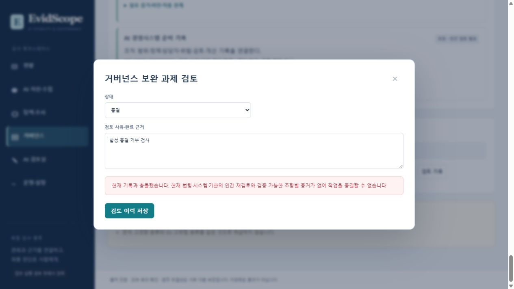

# 한국 AI 기본법 거버넌스 구현·검증 결과

검증일: 2026-10-06. 현재 코드의 Windows 전체 검사 **759/759**, 제한된 Linux 이미지의 관련 검사 **257/257**, 금융 증거 연결 합성 사례 **6/6**을 통과했다. 한국 요구사항은 14개에서 **18개**, 전체 목록은 27개에서 **31개**로 보강했다. 기술 증거 검사 유형 **20개**를 실제 보관 문서·인증 출처·현재 시스템 및 법령 해시에 연결했다. 이 결과는 구현과 명시된 재현 사례의 검증이며 법적 준수 인증이나 실제 금융사의 운영 실증이 아니다.

## 법령 확인과 적용 후보

[국가법령정보센터 현행 법률](https://www.law.go.kr/LSW/lsInfoP.do?lsiSeq=282791), [현행 시행령](https://www.law.go.kr/LSW/lsInfoP.do?lsiSeq=288781), 시행령 별표1, NIA의 관련 공식 안내서를 대조했다. 현행 법률 표제는 법률 제21311호·2026-07-21 시행, 시행령 표제는 대통령령 제36580호·2026-08-20 시행으로 확인했다. 기존 조문의 효력일을 이번 확인일로 바꾸지 않았다. 세부 출처, 본문 확인 범위, PDF 해시와 확인하지 못한 고시는 [법적 출처 문서](../docs/legal-sources.md)에 기록했다.

| 구현 항목 | 적용 후보 및 이행 증거의 구분 |
|---|---|
| 제30조 2개 | 사업자의 사전 검·인증 노력과 공공 이용자의 우선 고려를 구분한다. 미취득을 곧바로 위반으로 만들지 않는다. |
| 제31조 3개 | 사용 사전 고지, 생성형 결과 표시, 사실적인 합성물 표시를 분리한다. 비생성형 여부가 사실적 합성물의 표시를 자동 제외하지 않는다. 명백성·내부 업무·표현 방식 예외는 사람 검토로 남긴다. |
| 제32조 3개 | 연산량·첨단 기술·광범위한 중대 위험의 조건을 함께 검토하며 위험관리, 사고 대응, 결과 제출의 근거를 구분한다. |
| 제33조 1개 | 금융업이라는 이유로 고영향을 확정하지 않는다. 실제 사용 영향·영역·중대한 위험을 확인한다. 사전 검토 의무와 선택적 장관 확인 요청을 구분한다. |
| 제34조 5개 | 위험관리·설명·보호·사람 감독·문서를 구분한다. 게시 4항목, 제외 근거, 조치 문서 5년 보관 정책·접근·복구 시험을 연결한다. |
| 제35조 2개 | 영향평가 노력과 완료, 평가 내용 7항목 및 취약계층 특성, 공공 우선 고려를 구분한다. |
| 제36조 1개 | 국외 사업자의 국내 주소·영업소, 규모 및 제재 조건을 별도로 기록하고 지정·서면 위임·신고 접수 근거를 검토한다. |
| 제40조 1개 | 실제 기관 명령의 식별자·요청 조치·기한·대응 근거를 연결한다. 내부 차단 로그를 기관 명령으로 취급하지 않는다. |

시스템 사실관계 schema는 **4**, 적용 후보 정책 버전은 `evidscope-applicability-2026-10-06`이다. 국내 영향, 실제 AI사업자 여부, 국방·국가안보 전용 목적과 지정 업무, 제공 시작일, 국내대리인 판단 사실 등을 추가했다. 기존 기록의 누락 사실은 `unknown`으로 이관한다. 과거 서명된 시스템·평가 이력은 보존하며 두 차례 재시작 이후에도 이를 확인했다.

외부 AI 대출·신용평가 서비스를 도입한 은행은 계약과 실제 운영에 따라 AI이용자일 수 있다. 금융기관이라는 이유만으로 AI이용사업자로 고정하지 않는다. 공급사 조치 인정은 실제 제공 시스템·목적·변경 여부 및 제34조제1항제1~3호 범위에서 검토하며 사람 감독·문서 보관까지 자동 승계하지 않는다. 금융권 타법 인정 역시 설명·이용자 보호의 해당 개별 조치 범위에 한정한다.

## 실제 변경한 증거 검증

- 사용자가 `sufficient`라고 입력하거나 미확인 외부 문서·자기확인 문구만 연결해도 기술 증거 부족과 열린 과제를 유지한다. 법률 판단과 기술 증거 상태를 화면과 보고서에 따로 표시한다.
- `governance_check`는 허용된 telemetry 또는 authority 출처에서만 수집한다. 현재 시스템·모델·정책·요구사항 해시와 복구 가능한 보관 문서의 해시를 대조한다. agent 출처, 다른 모델의 기록, 미서명 SQL 사본, 호출자가 주입한 스냅샷은 근거를 대체하지 못한다.
- 발생·수신 시각과 선언된 시계 오차를 고정한다. 미래에 수행했다고 주장한 완료 기록, 미확인 시계 오차, 순서를 확정할 수 없는 시각은 지원 근거로 인정하지 않는다. 제공 전 검사 시각은 등록 시스템의 `providedAt`과 일치해야 한다. 미래 예정 제공일은 준비 범위의 근거다.
- 문서는 실제 파일을 암호화 보관·복구하며 파일 크기 한도는 **4MiB**다. 실제 HTTP에서 상한 파일의 업로드·전체 바이트 회수, 초과 파일 거부, 해시·버전·테넌트 경계를 확인했다. 큰 base64 입력에서 발생하던 정규식 스택 초과도 선형 검증으로 수정했다.
- 과제 종결은 writer transaction 안에서 현재 적용 후보·법령 목록·모델·문서·평가 만료·법률 검토 상태를 다시 검사한다. 부족하거나 오래된 근거, 미검토 법률 판단으로 닫을 수 없다. 제40조 과제는 같은 명령의 대응 근거를 요구한다.
- 당시 법령·시스템·문서·원본 이벤트·사람 판단을 고정 보고서로 서명한다. 모델 변경 후 재검토 상태와 과거 보고서의 불변성, 재시작·백업 복구 및 별도 공개키의 서명·체크포인트 검증을 확인했다.

수집 계약과 API 예시는 [구현 문서](../docs/kr-governance-evidence.md), 기계 판독 계약은 [현재 계약 JSON](kr-governance-check-contract-20261006.json)에 있다. 인증된 출처의 측정 보고는 그 내용의 독립 실측을 뜻하지 않는다. 서명은 변경 여부를 검증하며 원문 내용의 진실성을 보증하지 않는다.

## 검증 결과와 재현 자료

| 검사 | 최종 결과 | 실제 환경·자료 |
|---|---:|---|
| 전체 회귀 | **759/759** | Node 24.15 Windows 실제 호스트, 로컬 HTTP·TLS·파일·프로세스 경계 포함. [로그](kr-governance-host-regression-final-r3-20261006.log), 162.525초 |
| 관련 격리 검사 | **257/257** | Linux 이미지 r18, CPU 2·RAM 1GiB·비 root·읽기 전용 root·capability 없음·network none. 현재 이미지의 소스를 사용했으며 소스 bind mount 없음. [로그](kr-governance-container-r18-20261006.log), 19.200초 |
| 최종 수정 집중 검사 | **160/160** | 실제 Windows에서 문서·시각·적용 후보·과제·이력 검증. [로그](kr-governance-final-gaps-confirmed-20261006.log) |
| 금융 증거 연결 재실행 | **6/6** | 정상, 모델 변경, 목적 변경, 공급사 문서 개정, 감독 계획 개정, 감독 수행 기록 누락. HMAC 접수·서명 원장·보고서를 사용하는 합성 서비스 경계. [결과](kr-governance-six-cases-final-20261006.json) |
| 보존한 실증 자료 재검증 | **54/54 파일, 6/6 사례** | 원본·사본 SHA-256, 전후 보고서 12개 서명, 변조 거부, 공개키·고정 체크포인트·원장 대조. [복사 영수증](kr-governance-six-cases-copy-receipt-20261006.json), [재검증](kr-governance-six-cases-copied-verification-20261006.json) |
| 실제 브라우저 | **종결 거부와 상태 표시 확인** | 18개 요구사항·문서 상한·기술 부족 및 사람 판단 동시 표시, 열린 과제와 서버 409 종결 거부. 아래 화면 참조. 브라우저 파일 선택·업로드 완료는 미검증이다. |

이미지: `evidscope:kr-governance-20261006-r18`, Docker가 반환한 이미지 ID `sha256:d1f3e8fa61cff0cb1f6248acec240669dcbf5d1b51d2434bb0ce14fa9ba4f2b1`. 이미지 내부 핵심 코드·법령 목록·화면 파일 13개가 최종 호스트 파일과 모두 동일했다. [이미지 대조](kr-governance-image-source-match-20261006.json). 테스트와 보조 스크립트만 읽기 전용으로 mount했다. 이 제한 검사는 네트워크 정책의 Kubernetes 실증이나 실제 금융 연동을 대체하지 않는다.

최종 코드와 위 보고서·로그·계약·실증 결과의 SHA-256은 [검증 자료 목록](kr-governance-verification-manifest-20261006.json)에 기록했다. 이 로컬 목록 자체는 외부 신뢰점에 봉인한 운영 감사 증명서가 아니다.

별도 검토자가 재현한 미래 완료 시각·등록 제공 시각 불일치를 수정했다. 이어 명령 A의 실패 과제를 명령 B의 성공 근거로 종결할 수 있던 문제를 수정하고 독립 재검증했다. SQL의 과제 식별자 변조, 식별자 없는 기존 서명 과제의 최초 평가 복구, 같은 명령 A의 새 정상 대응으로만 종결하는 경로, 최초 실패 이력 보존을 확인했다.



재현 명령:

```powershell
node --test --test-concurrency=1 --test-timeout=90000 test/*.test.mjs
node scripts/kr-governance-contract.mjs
node scripts/portfolio-governance-demo.mjs --output reports/NEW-six-cases.json
```

마지막 명령은 새 경로만 허용한다. 과거 결과를 덮어쓰지 않는다. 기존 실패 기록도 남겼다: 초기 lock fixture 종료 누락, schema 4 이관에 맞지 않던 기존 기대값 2개, r16의 미등록 시스템 과제 기대값 1개를 수정했다. sandbox 내 temp rename `EPERM` 실패는 제품 성공으로 계산하지 않았으며 실제 호스트에서 같은 집중 검사를 통과했다. 브라우저 파일 선택 대기가 길어져 fixture가 종료된 실행도 파일 업로드 성공으로 계산하지 않았다.

## 로컬 학습과 자원 종료 상태

`public-qa-grounding-20261005-r4`는 인간이 작성·주석한 공개 KLUE-MRC 데이터로 **실제 optimizer 갱신 20회**를 완료했다. 원본 40회 후보에서 adapter만 가져오고 optimizer·schedule을 새로 시작했으므로 전체 adapter 이력은 60회이나 이 Job의 global step은 20이다. 640건 훈련 자료 중 320건을 소비했으며 미검토 합성 금융 540건을 훈련에 사용하지 않았다.

NF4 QLoRA·rank 8·길이 1024·batch 1·누적 16·CPU 2·컨테이너 RAM 12GiB, 기존 Reasoning 베이스를 유지했다. 실행 965.203초, CUDA peak 6,717,504,512 bytes였다. Job/Pod 종료, 후보 및 checkpoint-10/20, PVC 원본·회수본 해시, CPU에서 adapter 256개 텐서의 유한값을 검증했다. adapter SHA-256: `c3b836df159917cd9ababd61ed9f574ac5b77252b8ec058a66269b045c78d9f6`.

같은 베이스의 검증 loss는 1.28036에서 adapter 적용 0.07754였으나 한국어 생성 품질·무답 보류·근거 인용의 통과를 뜻하지 않는다. 새 후보의 64건 생성 비교는 아직 실행하지 못했다. 기존 40회 후보의 16/64 결과를 새 60회 이력 후보의 품질로 사용하지 않는다. 품질 인정·운영 후보 승격은 차단 상태다. [실제 학습 검증 JSON](public-qa-grounding-verification-20261005.json), [복구·학습 기록](public-qa-grounding-and-recovery-20261005.md).

전용 학습 GPU 노드는 정지했고 DLP의 원래 5개 컨테이너는 같은 ID로 실행 중이다. 검증 컨테이너는 제거됐고 임시 브라우저·lock child가 남지 않았다. 기존 작업 설정과 사용자 앱을 변경하지 않았다. [자원 상태 영수증](kr-governance-resource-status-20261006.json).

## 검증 한계와 남은 제품 과제

최종 고시 전체·위원회 추가 지정의 확인, 외부 기관 확인·재확인 절차의 실접수와 고시별 제출 서식, 국내대리인의 회사 단위 누적 사건 관리까지 완결된 법률 업무 엔진은 아니다. 현재 국내대리인 근거는 시스템·모델 범위에 연결된다. 실제 사업자·계약·변경·타법 이행의 인정, 자연어 문서의 충분성, 모든 이용자·모든 출력의 표시 및 접근성은 담당자 검토가 필요하다. 5년 보관 정책과 복구 시험을 확인했으며 실제 5년이 경과한 보존을 실증하지 않았다.

이번 금융 6개 사례는 합성 자료의 같은 프로세스 서비스 경계이며, 별도의 로컬 HTTP 검사가 프로세스·인증·테넌트·회수 경계를 보완한다. 실제 금융 고객 자료·기관 시스템·경쟁 제품을 연결한 실증은 수행하지 않았다. xsoft comply, KOMPLI, Regula, AGT보다 우월하거나 더 간단하다는 결론은 내리지 않는다. 기존 수집·서명·승인·문서 보관을 재사용했고, 별도의 승인 발급 엔진이나 상용 문서관리 제품 전체를 추가하지 않았다.

지속 목표의 상태는 **progress**다. 이번 검증 범위의 코드 수정과 재현 검사는 완료했으며, 실제 금융 연동·사람의 법률 충분성 검토·새 adapter 생성 평가·경쟁 제품 동일 입력 비교는 별도의 완료 근거가 필요하다.
